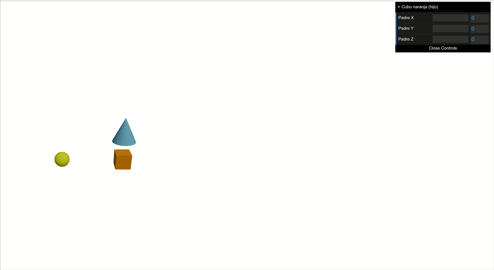
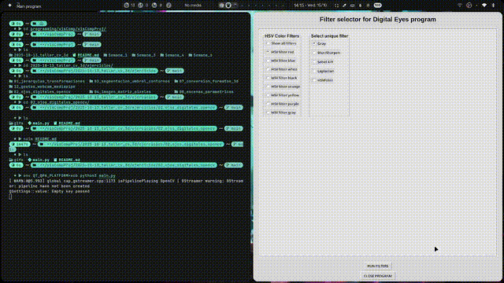
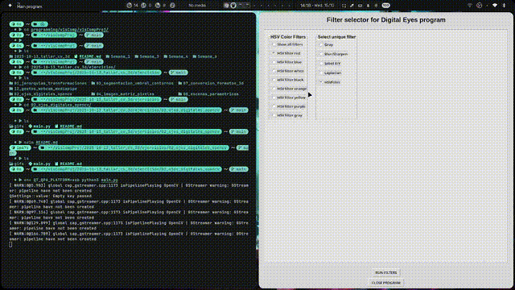
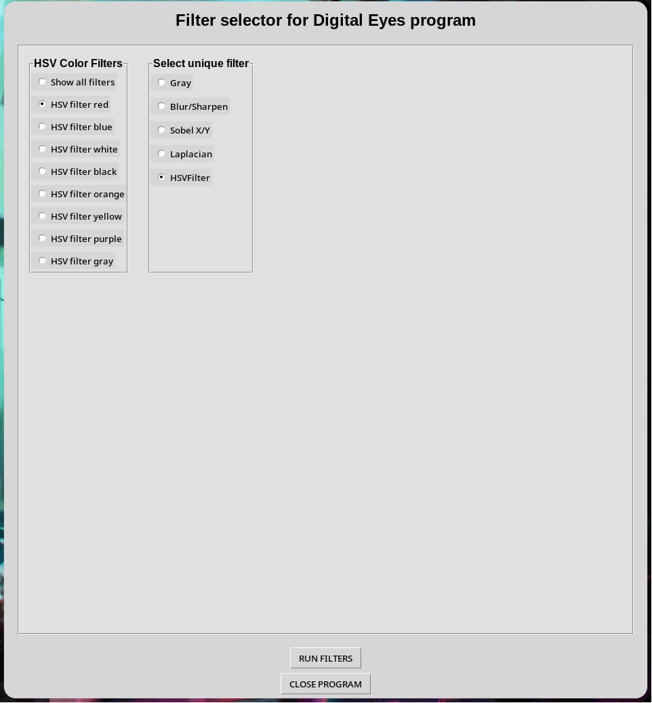
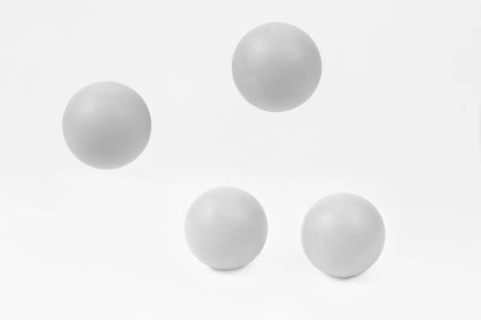
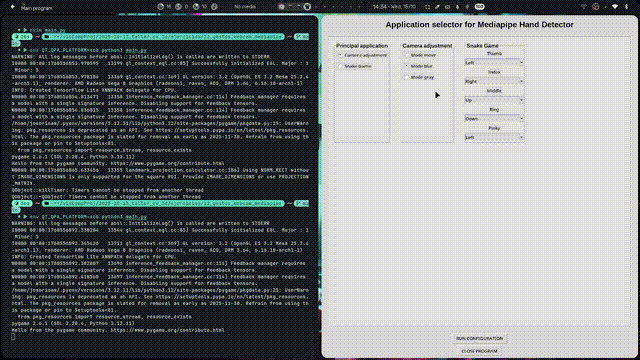
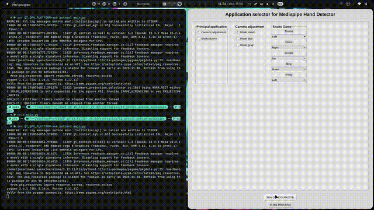
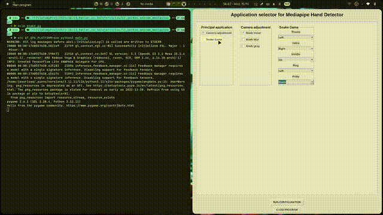
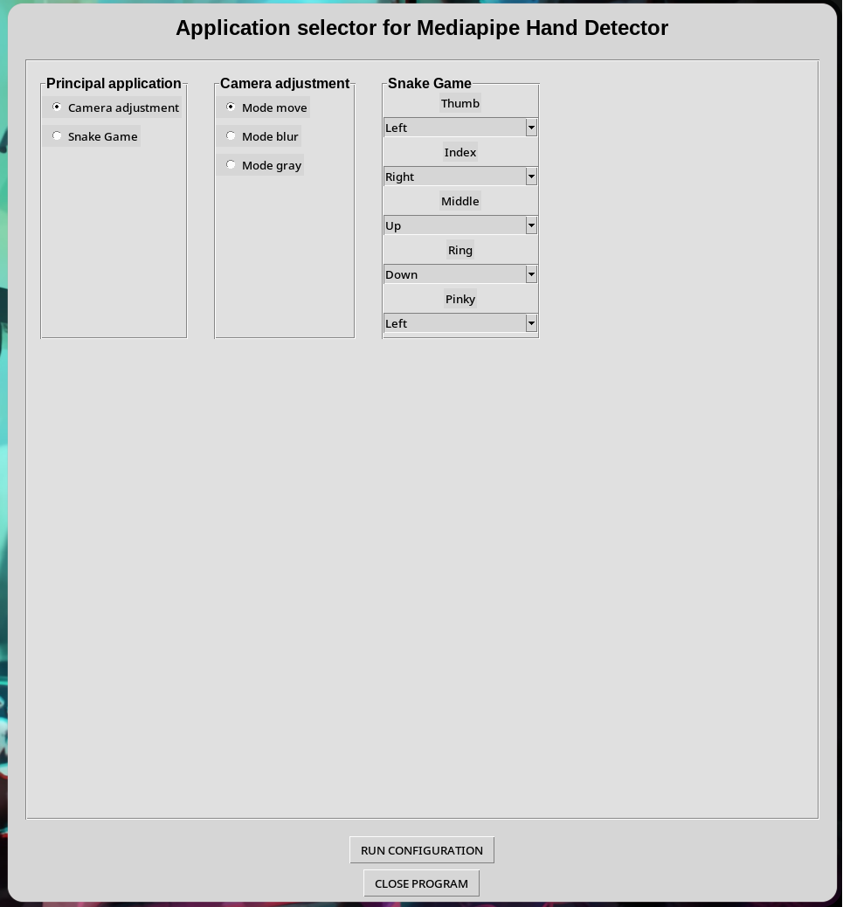

## Taller cv 3d

#Integrantes del equipo

- Deibyd Santiago Barragán Gaitán.
- Paul Marie Emptoz.
- Juan Felipe Hernandez Ochoa.
- Juan Diego Mendoza Torres.
- Julián David Osorio Amaya.

# Resumen del taller
Se busca con el taller poder trabajar varios de los temas iniciales que se presentan a la hora de trabajar en el desarollo de modelado 3D y vision por  cumputador. 
Se tocan temas como
- Jerarquías y transformaciones en 3D.
- Proyecciones de cámara (perspectiva y ortográfica).
- Rasterización clásica de figuras.
- Visión artificial, incluyendo filtros, detección de bordes, segmentación y análisis geométrico.
- Modelos de color y su manipulación.
- Conversión e inspección de diferentes formatos 3D.
- Generación de escenas paramétricas a partir de datos.
- Implementación de filtros por convolución personalizada.
- Control de aplicaciones mediante gestos con una webcam.

La meta es alcanzar a entender la metodologia de estos temas, como se pueden relacionar unos con otros y la implementacion de estos mismos a la hora de procesar imagenes o videos frame a frame.

# Ejercicios realizados
1. JERARQUIAS TRANSFORMACIONES

**Explicación**
Se creó una escena 3D usando React Three Fiber que muestra una jerarquía de objetos: un objeto padre que contiene un hijo y un nieto.
Se implemetó controles independientes usando la librería dat.GUI para rotar cada nivel (padre, hijo y nieto) y observar cómo las rotaciones se comportan en la jerarquía, lo que permite entender la herencia y composición de transformaciones en gráficos 3D.
Se decidió reorganizar los objetos para que el pequeño nieto (un cono azul) tenga una rotación visible clara, separándolo de otros hijos, y traducir toda la interfaz al español para facilitar el entendimiento.

**GIFS**



**Link del codigo**

[Ejercicio 1](ejercicios/01_jerarquias_transformaciones)

**Prompts utilizados**

Ninguno, el código fue escrito manualmente y guiado por la lógica de React y React Three Fiber para creación de jerarquías visuales.

**Comentarios personales**

- Aprendizaje: Este ejercicio me permitió comprender en profundidad cómo funcionan las transformaciones jerárquicas en Three.js/React Three Fiber, y cómo controlar visualmente cada elemento con dat.GUI.
- Retos: Configurar el entorno de desarrollo y resolver problemas con la versión de Node.js para hacer funcionar Vite. También entender la correcta configuración de las rotaciones independientes.
- Mejoras futuras: Agregar animaciones automáticas, crear más niveles de jerarquía, y experimentar con otras propiedades (escala, posición, materiales dinámicos). Mejorar la interfaz de usuario para hacerla más intuitiva.

---

2. OJOS DIGITALES

**Explicación**

El programa se generó de tal manera que fuera cómodo e intuitivo, la distribución de las ventanas y demás configuraciones visuales buscan que sea fácil diferenciar las diferencias entre el video (webcam) base y el filtro o filtros aplicados.
Se implemento el ejercicio mediante las siguientes etapas:
- Investigación de funcionalidades de OpenCv para generación de filtros y manejo de trackbars.
- Implementación de filtros básicos.
- Investigación de funcionalidades de TKinter para generación de menús.
- Integración de menú en Tkinter con funciones de generación de filtros.

**GIFS**

Todos los filtros aplicados (HSV filtrando color amarillo):  


Filtros de blur/sharpening:  


Filtros Sobel X/Y:  


Filtro laplaciano:  


Filtro en escala de grises:  


Filtro de colores con HSV(Amarillo):  


Interfaz gráfica:  


**Link del codigo**

[Ejercicio 2](ejercicios/02_ojos_digitales_opencv)

**Prompts utilizados**

- Genera un código de ejemplo aplicando filtros de blur/sharpen, laplaciano, sobel X/Y, explica cada paso.
- Cuéntame sobre librerías para interfaces gráficas en Python que sean útiles para generar menús.
- Cuéntame sobre funcionalidades básicas de Tkinter.

**Comentarios personales**

En este taller se aprendió a aplicar distintos tipos de filtros a imágenes y videos, manejar la webcam por medio dee OpenCv en Python y generar interfaces gráficas para la muestra de distintas funcionalidades.

En los próximos proyectos se mejorará el manejo del tiempo y se intentará generar una interfaz gráfica más cómoda y personalizada, que permita interactuar mejor con las funcionalidades aplicadas en el código.

---

3. SEGMENTACIÓN UMBRAL CONTORNOS

**Explicación**

En este ejercicio se implementó la segmentación de una imagen utilizando técnicas de umbralización fija y adaptativa. El objetivo fue detectar las formas presentes (esferas) mediante la detección de contornos en la imagen binarizada. Se calculó las propiedades geométricas claves: centroide (usando momentos), área y perímetro de cada contorno. Además, se realizó una clasificación básica por número de vértices para aproximar la forma de cada contorno. Se descartaron contornos excesivamente grandes (como bordes de la imagen) para evitar falsos positivos.

**GIFS**

El GIF generado muestra secuencialmente:
- La imagen original en escala de grises,
- La imagen con umbral fijo invertido,
- La imagen con umbral adaptativo,
- Finalmente, la imagen con los contornos dibujados y la información de centroide, área, perímetro y vértices anotada.  


**Link del codigo**

[Ejercicio 3](ejercicios/03_segmentacion_umbral_contornos)

**Prompts utilizados**

No se utilizaron prompts automáticamente; el desarrollo fue realizado manualmente con conocimiento de OpenCV y procesamiento de imágenes.

**Comentarios personales**

- Aprendizaje: Comprender cómo aplicar umbralización fija y adaptativa, junto con detección y análisis de contornos usando OpenCV.
- Retos: Ajustar correctamente los parámetros de umbral para diferentes condiciones de imagen y filtrar los contornos no deseados.
- Mejoras futuras: Integrar un sistema de clasificación de formas más avanzado, implementación de más técnicas de filtrado de ruido y ampliación para trabajar con imágenes en color.

---

4. IMAGEN MATRIZ PIXELES

**Explicación**

En este ejercicio se trabajó directamente sobre los píxeles y regiones de una imagen usando Python con OpenCV y NumPy. Se seleccionó una zona específica, se coloreó de rojo puro, y se copió en otra parte de la imagen para demostrar la manipulación básica por regiones. Posteriormente, se realizaron ajustes de brillo y contraste con una interfaz interactiva. Para analizar los efectos de cada manipulación, se calcularon y mostraron los histogramas globales y por región (antes y después de las modificaciones), utilizando tanto el canal de luminosidad (V en HSV) como el canal rojo (R en BGR). Este análisis evidencia cómo las transformaciones afectan la distribución de los valores de los píxeles de la imagen.

**GIFS**


**Link del codigo**

[Ejercicio 4](ejercicios/04_imagen_matriz_pixeles)

**Prompts utilizados**

No se emplearon prompts automáticos. Todo el código y los assets fueron desarrollados manualmente, siguiendo las consignas y ajustando cada paso para observar su efecto en los histogramas.

**Comentarios personales**

- Aprendizaje: Aprender a manipular directamente los píxeles y regiones de una imagen y a analizar los efectos en los histogramas globales y locales.
- Retos: Entender cómo calcular los histogramas por regiones específicas y adaptar el código para incluir ambos tipos (global y por región). Integrar el sistema de copia y pegado para asegurar cambios visuales detectables.
- Mejoras futuras: Agregar análisis automatizado sobre más regiones; implementar sliders para ver los histogramas en tiempo real; y crear una visualización que compare directamente la evolución del histograma en cada paso del procesamiento.

---

5. Rasterización desde Cero (Línea, Círculo, Triángulo)
  
**Explicación**

Bresenham tiene como bjetivo el dibujar una línea entre dos puntos usando solo operaciones enteras, evita cálculos con números decimales o flotantes, logrando mayor eficiencia.
punto medio Dibujas círculos perfectos de forma eficiente, usa simetría y cálculos enteros para reducir el trabajo computacional. Scanline por su parte
rellenar un triángulo delimitado por tres vértices con color.

Finalmente, estos tres algoritmos constituyen la base de cualquier motor de gráficos 2D/3D.
Bresenham define los bordes, Punto Medio define curvas, Scanline permite el relleno de figuras.

**imagenes**


**Link del codigo**

[Ejercicio 5](ejercicios/05_rasterizacion_clasica)


6. ANALISIS FIGURAS GEOMETRICAS

**Explicación**

Se realizó el cargue, la binarización y se limpio el fondo mediante threshold a una imagen para poder aplicar y extraer diferentes caracteristicas de esta.
- Se extrajo los contornos de la figura principal de la imagen. Estos fueron delineados con rojo
- Se valido el área y el perímetro del contorno con mayor área
- Se calculo el centroide de área de mayor tamaño

**GIFS**


**Link del codigo**

[Ejercicio 6](ejercicios/06_analisis_figuraas_geometricas)

**Prompts utilizados**

No se utilizaron. El codigo se realizo mediante aprendizaje y busqueda de tutoriales.

**Comentarios personales**

- Aprendizaje: Utilización del contorno de los objetos de una imagen para su estudio y análisis.
- Retos: Poder entender y aplicar los comandos para la extracciónd de los contornos de la imagen
- Mejoras futuras: automatizar para analizar frame a frame el contorno variable de un video 

---

7. CONVERSIÓN FORMATOS 3D

**Explicación**

Se desarrolló una aplicación web interactiva que compara tres formatos 3D (OBJ, STL, GLTF) para entender sus diferencias técnicas y visuales. Se utilizó Three.js con React porque permite cargar múltiples formatos y renderizarlos con WebGL. Se incluyó un script Python con trimesh para generar los modelos y garantizar que todos tengan la misma geometría base.

El proyecto permite alternar entre formatos, activar wireframe, y ver estadísticas en tiempo real. La idea era demostrar que aunque la geometría sea idéntica, cada formato maneja colores, materiales y compresión de forma diferente.

**GIFS**

Selector de Formatos  


Modo Wireframe  


Tabla comparativa principal  
| Métrica | OBJ | STL | GLTF |
|---------|-----|-----|------|
| Vértices | 1,220 | 1,220 | 1,220 |
| Caras | 2,432 | 2,432 | 2,432 |
| Tamaño | 116.41 KB | 118.83 KB | 48.50 KB |
| Colores | Sí (.mtl) | No | Sí (integrado) |
| Animaciones | No | No | Sí |
| Compresión | No | No | Binaria (GLB) |

**Link del codigo**

[Ejercicio 7](ejercicios/07_conversion_formatos_3d)

**Prompts utilizados**

Para implementación:
- "Cómo se cargan diferentes formatos 3D en Three.js usando React?"
- "Cómo aplicar materiales wireframe a objetos cargados desde archivos externos?"
- "Qué librerías de Python permiten exportar modelos 3D a múltiples formatos y cómo se usan?"

Para debugging:
- "Por qué el wireframe solo funciona en STL pero no en OBJ ni GLTF?"
- "Cómo centrar modelos 3D de diferentes formatos para que se vean del mismo tamaño en Three.js?"

Para optimización:
- "Explica las diferencias de tamaño entre archivos OBJ, STL y GLTF del mismo modelo"
- "Qué método usa GLTF para comprimir geometría y reducir el tamaño de archivo?"

Los modelos 3D se generaron programáticamente sin IA, solo primitivas geométricas de trimesh (icosphere, cylinder, torus).

**Comentarios personales**

Aprendizaje:
- Los formatos 3D no son simplemente "archivos diferentes", cada uno fue diseñado con un propósito específico en mente.
- GLTF maneja compresión binaria de forma eficiente, lo cual explica por qué se ha convertido en el estándar para aplicaciones web.
- STL está realmente optimizado solo para fabricación, no para visualización, lo que explica su simplicidad estructural.

Retos
- Lograr que el wireframe funcionara en OBJ y GLTF. Estos formatos crean jerarquías de objetos anidados, no geometrías directas como STL. Fue necesario usar traverse() para aplicar wireframe recursivamente a todos los meshes de la escena.
- Centrar los modelos correctamente usando Box3 para que todos se visualizaran con el mismo tamaño aparente, independientemente de su formato.

Mejoras Futuras
- Permitir cargar modelos personalizados desde archivos locales mediante drag & drop.
- Agregar más estadísticas como área de superficie, volumen y densidad de malla.
- Comparar tiempos de carga real de cada formato con modelos de diferentes tamaños.

---

8. ESCENAS PARAMETRICAS

**Explicación**

Este ejercicio implementa generación de geometría 3D a partir de datos estructurados en JSON usando Three.js con React Three Fiber. La meta es mapear arrays de objetos JavaScript a componentes `<mesh>` parametrizando posición, escala y color directamente desde archivos de datos. Se implementaron tres escenas diferentes: una con objetos variados posicionados manualmente, un patrón de grilla generado proceduralmente, y una espiral 3D con gradiente de color. Se incluyeron controles GUI con Leva para modificar parámetros en tiempo real y exportar las configuraciones.

Escena 1: Objetos desde JSON
Se leyó un array de objetos desde sceneData.json y se mapeo cada elemento a un componente `<mesh>` con geometría, posición, escala y color parametrizados. Soporta 8 tipos de primitivas (box, sphere, cone, cylinder, torus, octahedron, tetrahedron, icosahedron).
Se creó un componente ParametricObject que toma datos JSON y los convierte en geometrías Three.js. Se usó un switch para seleccionar el tipo de geometría y apliqué las propiedades directamente desde el objeto de datos.

Escena 2: Patrón de Grilla Procedural
Se generó una matriz NxN de esferas en el plano XZ calculando posiciones mediante bucles anidados. Los parámetros gridSize y spacing en el JSON controlan la cantidad y separación de objetos.
El componente GridPattern lee parámetros y genera posiciones automáticamente usando (i - center) * spacing para centrar la grilla. Se agregó variación de escala basada en la distancia al centro para crear efecto visual.

Escena 3: Espiral Paramétrica 3D
Se distribuyó objetos en forma helicoidal usando funciones trigonométricas. Las posiciones se calculan con cos(angle) y sin(angle) para el movimiento circular, mientras la coordenada Y aumenta linealmente para crear altura.
Se Implementó el algoritmo de espiral paramétrica donde cada objeto tiene un ángulo θ = (i / count) * rotations * 2π. Se agregó interpolación de color entre colorStart y colorEnd usando el índice normalizado.

GUI Interactivo con Leva
Se implementó controles para cambiar entre escenas, ajustar escala global, animación, cámara, iluminación y exportar JSON. El botón "Export Scene" descarga la configuración actual como archivo.
Se usó useControls de Leva para crear sliders, selectores y botones. El control de distancia de cámara lo hice funcional con un componente CameraController que actualiza la posición usando useThree().

**GIFS**

Escena 1  


Escena 2  


Escena 3  


GUI interactivo  


**Link del codigo**

[Ejercicio 8](ejercicios/08_escenas_parametricas)

**Prompts utilizados**

- "Crea un proyecto React con Vite que use Three.js y React Three Fiber para renderizar escenas 3D"
- "Cómo generar una grilla NxN de objetos 3D en el plano XZ usando bucles en React Three Fiber"
- "Algoritmo para distribuir objetos en forma de espiral 3D usando trigonometría (seno y coseno)"
- "Cómo interpolar colores en formato hexadecimal entre dos valores usando un índice normalizado"
- "Integrar Leva para crear controles GUI en React Three Fiber"
- "Hacer que la distancia de cámara en Three.js se actualice dinámicamente cuando cambia un slider usando useThree hook"
- "Implementar botón de reset para OrbitControls en React"
- "Función para exportar objeto JavaScript como archivo JSON descargable desde el navegador"

**Comentarios personales**

- Aprendizaje: Entender cómo transformar datos estructurados en representaciones visuales 3D. Quedo claro que mapear arrays a componentes React es directo, pero controlar aspectos como la cámara requiere trabajar fuera del ciclo de renderizado normal de React usando hooks específicos de R3F.
- Retos: El control dinámico de la cámara fue problemático porque las props del `<Canvas>` son estáticas. Se tubo que crear un componente interno que accede al contexto de Three.js con useThree() para actualizar la posición en cada cambio del slider. Se ajustó cómo sincronizar el estado de React con los controles de Leva.
- Mejoras futuras: Agregar importación de CSV para generar escenas desde datasets reales, implementar más algoritmos generativos (fractales, noise), y permitir editar visualmente la posición de objetos con gizmos tipo editor 3D.

---

9. CONVOLUCIONES PERSONALIZADAS

**Explicación**

Se generó la implementación de las convoluciones a una imagen de manera manual (Creando la matriz para la comvolución) y de manera autamatica con la función cv2.filter2D de la libreria de CV2.
En primera instacia se creó una funcion que aplica la matriz de convolución a la imagen para efectuar el filtro. Luego, se generó un banco de matrices para los diferentes filtros (sharpen, blur, bordes horizontales y bordes verticales). Finalmente, se aplicó a la imagen el filtro mediante la función de cv2 y mediante la funcion creada en el codigo para evidenciar las diferencias.

**GIFS**

La imagen de arriba es la original
La de la izquierda es el filtro automatico
La de la derecha es el filtro manual

Orden de la visualización
- Sharpen
- Bordes verticales
- Bordes horizontales
- Blur


**Link del codigo**

[Ejercicio 9](ejercicios/09_convoluciones_personalizadas)

**Prompts utilizados**

- Explicame como funciona el filtro blur en una convolución para aplicar en una matriz
- Explicame como funciona el filtro sharpen en una convolución para aplicar en una matriz
- Explicame como funciona el filtro de bordes en una convolución para aplicar en una matriz

**Comentarios personales**

- Aprendizaje: Entender cómo la funcion de convolución de CV2 trabaja internamente para aplicar el filtro correspondiente.
- Retos: Generar la función que aplicara el filtro de cualquier matriz que se le porporcionara y que este funcionara
- Mejoras futuras: Agregar mas filtros para poder probar y entender su funcionamiento a detalle.

---

10. MODELOS COLOR PERCEPCION

**Explicación**

A una imagen cualquiera aplicarle diferentes filtros de color para poder ver las diferencias y persepciones que generan estos al espectador.
Se aplicaron los filtros de daltonismo, de temperatura frío y calido, de alta y baja iluminación, inverción de colores y monocromismo.
Adicional a esto, se aplico la información de color RGB - HSV - Lab a la imagen.

Para cada apartado de filtro, se generó una función propia que modifica a la imagen original.

**GIFS**


**Link del codigo**

[Ejercicio 10](ejercicios/10_modelos_color_percepcion)

**Prompts utilizados**

- Como es el filtro para el daltonismo en OpenCV
- Como es el filtro para la inversión en OpenCV
- Como es el filtro para el monocromismo en OpenCV

**Comentarios personales**

- Aprendizaje: Entender cómo modificando la gama de colores de una imagen se puede percibir y entender la imagen de maneras diferentes.
- Retos: Generar las diferentes funciones que modifiquen de diferentes maneras la gama de colores de una imagen
- Mejoras futuras: Poder implementar esta modificación de colores a un video aplicando los filtros frame a frame.

---
11.  Proyecciones 3D (Perspectiva vs Ortográfica)
**Explicación**

Mediante el uso de PerspectiveCamera podemos crea una cámara con perspectiva realista, pues simula una camara real,
con OrthographicCamera proyecta sin perspectiva, no hay distroción por distancia y es usado para vistas 2D o técnicas, 
OrbitControls permite rotar, hacer zoom y mover la cámara con el mouse; El HUD dinámico muestra datos 
actualizados en pantalla, finalmente con Vector3.project(camera) convierte coordenadas 3D en 2D para mostrar puntos en pantalla.

*Implementación*

Usamos un archivo HTML, JS y Vite, pues la librería Three,js nos dió problemas en un principio cuando la llamabamos, pero Vite 
resuelve estos problemas de importar modulos, este es el proceso que se siguió
1. Inicializa el entorno 3D creando la escena, la cámara y el renderizador.
2. Configura una PerspectiveCamera para obtener una vista realista del cubo.
3. Añade OrbitControls para permitir rotar, hacer zoom y mover la cámara con el mouse.
4. Crea un cubo geométrico con material básico y lo añade a la escena.
5. Genera un HUD dinámico que muestra información de la cámara en tiempo real.
6. Anima el cubo haciendo que gire de forma continua en el eje X e Y.
7. Renderiza cada frame con requestAnimationFrame, actualizando la vista 60 veces por segundo.
8. Calcula la proyección de un punto 3D sobre la pantalla usando Vector3.project(camera).
9. Muestra visualmente en el HUD la posición 2D proyectada del punto.

**GIFS**

/Ejercicio11.gif)

**Link del codigo**

/main.js)


12. GESTOS WEBCAM MEDIAPIPE

**Explicación**

Etapas realizadas
- Investigación de funcionalidades de Mediapipe para generación de landmarks (conteo de dedos, distancias y generación de lista de dedos "arriba").
- Implementación de landmarks y código en mediapipe.
- Implementación de funciones de filtros y lógica de webcam.
- Investigación de funcionamiento de Pygame.
- Implementación de juego de snake.
- Implementación de interfaz gráfica para activación de modos.
- Integración de funcionalidades.
- Intento de uso de threads.

El programa se generó de tal manera que fuera cómodo e intuitivo, la distribución de las ventanas y demás configuraciones visuales buscan que sea agradable a la vista. Por otro lado, se intentó implementar el funcionamiento con threads (debido a pygame y sus requerimientos de funcionamiento). Sin embargo, esto generó un bloqueo que no permite que se ejecute más de 1 modo en una sola ejecución del programa.

**GIFS**

Control de filtro Blur:  


Control de escala de grises:  


Control de movimiento de pantalla:  


Control de Snake con gestos:  


Interfaz gráfica:  


**Link del codigo**

[Ejercicio 12](ejercicios/12_gestos_webcam_mediapipe)

**Prompts utilizados**

- Necesito generar landmarks de manos usando mediapipe en Python.
- Cuéntame sobre funcionalidades básicas de pygame.
- Necesito generar un juego de Snake en python usando pygame.

**Comentarios personales**

En este taller se aprendó un sobre el tipo de desafios que se enfrentan al manejar una arquitectura de múltiples funcionalidades. Adicionalmente, se aprendió sobre algunas funciones de mediapipe y cómo pueden ser útiles para la implementación de programas que interactuén con la webcam.

En los próximos proyectos se mejoraró el manejo del tiempo e intentaré generar una interfaz gráfica más cómoda y personalizada, que permita interactuar mejor con las funcionalidades aplicadas en el código. Adicionalmente, se aprenderá un poco más sobre el manejo de threads para generar una verdadera integración de funcionalidades en los proyectos.

# DEPENDECIAS

- npm install
- pip install trimesh numpy
- python convert_models.py
- @react-three/fiber
- @react-three/drei
- leva
- react
- react-dom
- mediapipe
- pygame

# ESTRUCTURA DEL REPOSITORIO

```
2025-10-13_taller_cv_3d/
├── ejercicios/
│   ├── 01_jerarquias_transformaciones/
│   ├── 02_ojos_digitales_opencv/
│   ├── 03_segmentacion_umbral_contornos/
│   ├── 04_imagen_matriz_pixeles/
│   ├── 05_rasterizacion_clasica/
│   ├── 06_analisis_figuras_geometricas/
│   ├── 07_conversion_formatos_3d/
│   ├── 08_escenas_parametricas/
│   ├── 09_convoluciones_personalizadas/
│   ├── 10_modelos_color_percepcion/
│   ├── 11_proyecciones_camara/
│   └── 12_gestos_webcam_mediapipe/
├── gifs/
├── README.md
```
