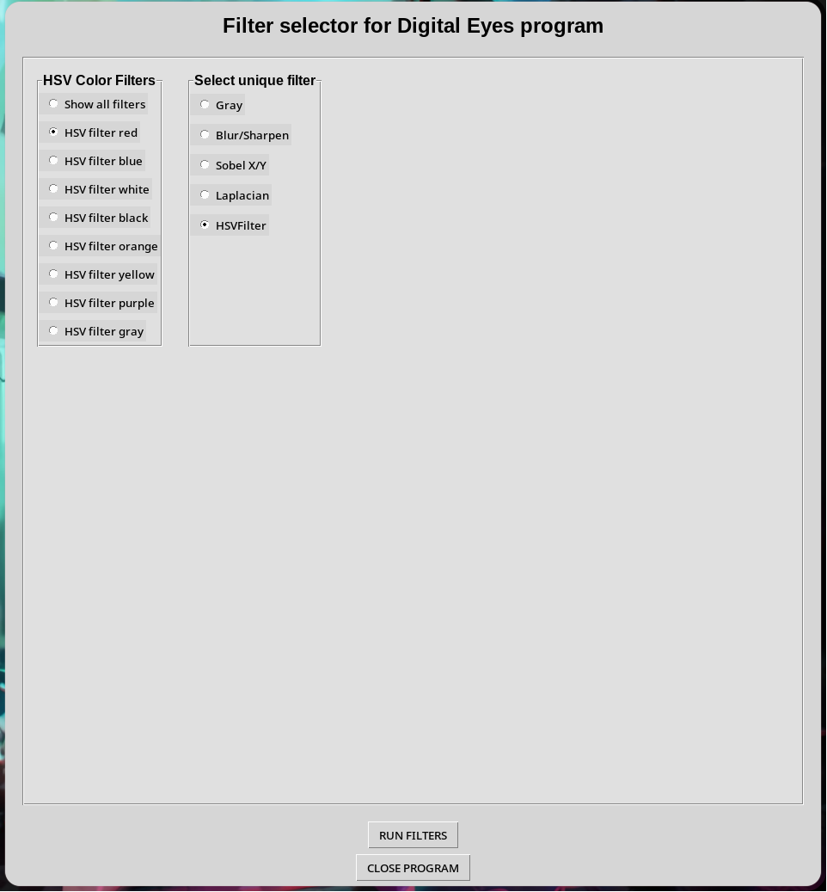

# Taller 2 - 02 _ Ojos digitales

## Fecha
`2025-10-15` 

---

## Objetivo general del Taller


Integrar en un solo taller (multi-módulo) los temas de gráficos 3D y visión por computador: jerarquías y transformaciones, proyecciones de cámara, rasterización clásica, visión artificial (filtros, bordes, segmentación, análisis geométrico), modelos de color, conversión e inspección de formatos 3D, escenas paramétricas desde datos, filtros por convolución personalizada, y control por gestos con webcam.
Cada tema se aborda como un ejercicio independiente dentro del mismo taller, con entregables homogéneos y una rúbrica común.

---
## Meta del ejercicio 


Entender el flujo básico de percepción: escala de grises, filtros y bordes.

---

## Conceptos Aprendidos

Lista los principales conceptos aplicados:

- [X] Uso de Tkinter para menús básicos.
- [X] Uso de trackbars en OpenCv.
- [X] Configuración de ventanas en OpenCv.
- [X] Implementación de filtros de blur/sharpening, sobel x/y, laplaciano y escala de grises.
- [X] Manejo de webcam en vivo por medio de OpenCv,

---

## Herramientas y Entornos

- Python (OpenCv, Tkinter, numpy)

---

## Estructura del Proyecto

```
02_ojos_digitales_opencv/
├── main.py
├── gifs/
│   ├── allFilters.gif 
│   ├── blurSharp.gif
│   ├── sobel.gif
│   ├── laplacian.gif
│   ├── hsvFilter.gif
│   └── interface.png
└── README.MD
```

---

## Implementación

### Etapas realizadas

1. Investigación de funcionalidades de OpenCv para generación de filtros y manejo de trackbars.
2. Implementación de filtros básicos.
3. Investigación de funcionalidades de TKinter para generación de menús.
4. Integración de menú en Tkinter con funciones de generación de filtros.

### Código relevante

Función generadora de todos los filtros del programa de Ojos Digitales:

```javascript
// generate all filters
def allFilters(width, height, color = "red"):
    cap = cv.VideoCapture(0)
    names = ["frame", "gray", "blur", "sobel", "laplacian", "result"]
    for name in names:
        cv.namedWindow(name)

    for i,name in enumerate(names, start = 0):
        col = i % 3
        row = i // 3
        cv.waitKey(1)
        cv.moveWindow(name, (width // 3) * col, (height // 2) * row)
        cv.resizeWindow(name, width // 3, height // 2)

    dict = {"red" : [np.array([180, 255, 255]), np.array([159, 50, 70])], 
            "blue" : [np.array([128, 255, 255]), np.array([90, 50, 70])], 
            "yellow" : [np.array([35, 255, 255]), np.array([25, 50, 70])], 
            "orange" : [np.array([24, 255, 255]), np.array([10, 50, 70])],
            "black" : [np.array([180, 255, 255]), np.array([0, 0, 0])], 
            "purple" : [np.array([158, 255, 255]), np.array([129, 50, 70])],
            "gray" : [np.array([180, 18, 230]), np.array([0, 0, 40])], 
            "white" : [np.array([180, 18, 255]), np.array([0, 0, 231])]
            }

    while True:
        _, frame = cap.read()

        hsv = cv.cvtColor(frame, cv.COLOR_BGR2HSV)
        mask = cv.inRange(hsv, dict[color][1], dict[color][0])
        result = cv.bitwise_and(frame, frame, mask = mask)

        gray = cv.cvtColor(frame, cv.COLOR_BGR2GRAY)

        sobelx = cv.Sobel(gray, cv.CV_64F, 1, 0, ksize = 5)
        sobely = cv.Sobel(gray, cv.CV_64F, 0, 1, ksize = 5)
        sobelx = cv.convertScaleAbs(sobelx)
        sobely = cv.convertScaleAbs(sobely)
        sobel = cv.addWeighted(sobelx, 0.5, sobely, 0.5, 0)

        blur = cv.GaussianBlur(frame, (25, 25), 0) 

        laplacian = cv.Laplacian(gray, cv.CV_64F)
        laplacian = cv.convertScaleAbs(laplacian)

        
        for name in names:
            cv.imshow(name, locals()[name])

        key = cv.waitKey(1)
        if key == 27:
            break     
    cv.destroyAllWindows()
    cap.release()
```

---

## Gifs/capturas de pantalla de muestra  

#### Todos los filtros aplicados (HSV filtrando color amarillo):


#### Filtros de blur/sharpening:


#### Filtros Sobel X/Y:


#### Filtro laplaciano:


#### Filtro en escala de grises:


#### Filtro de colores con HSV(Amarillo):


#### Interfaz gráfica:


---

## Explicaciones

#### Programa Ojos Digitales

El programa se generó de tal manera que fuera cómodo e intuitivo, la distribución de las ventanas y demás configuraciones visuales buscan que sea fácil diferenciar las diferencias entre el video (webcam) base y el filtro o filtros aplicados.

## Prompts Usados

- Genera un código de ejemplo aplicando filtros de blur/sharpen, laplaciano, sobel X/Y, explica cada paso.
- Cuéntame sobre librerías para interfaces gráficas en Python que sean útiles para generar menús.
- Cuéntame sobre funcionalidades básicas de Tkinter.

---

## Reflexión Final

En este taller aprendí a aplicar distintos tipos de filtros a imágenes y videos, manejar la webcam por medio dee OpenCv en Python y generar interfaces gráficas para la muestra de distintas funcionalidades.

En los próximos proyectos mejoraré el manejo del tiempo e intentaré generar una interfaz gráfica más cómoda y personalizada, que permita interactuar mejor con las funcionalidades aplicadas en el código.

---

## Checklist de Entrega

- [x] Carpeta `02_ojos_digitales_opencv`
- [x] Filtros aplicados en webcam en tiempo real.
- [x] Carpeta y estructura del repositorio ordenada.
- [x] GIFs incluido con nombre descriptivo.
- [x] README completo y claro.
- [x] Commits descriptivos en inglés.
- [x] Documentación clara.

---
