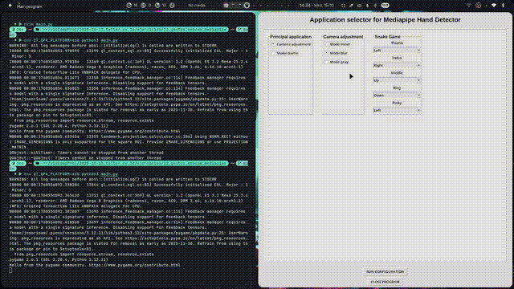
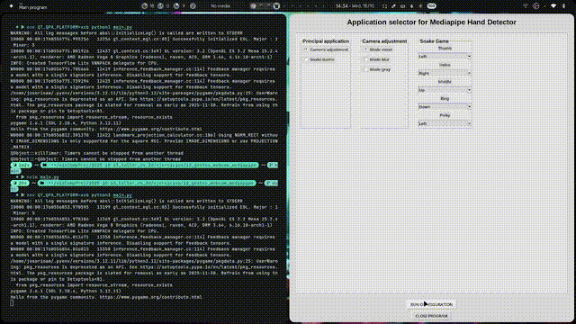
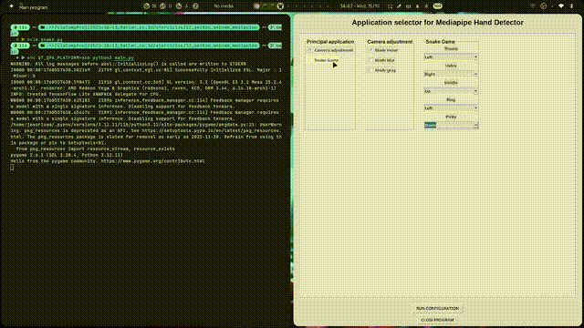

# Taller 2 - 12 _ Gestos webcam con Mediapipe

## Fecha
`2025-10-15` 

---

## Objetivo general del Taller


Integrar en un solo taller (multi-módulo) los temas de gráficos 3D y visión por computador: jerarquías y transformaciones, proyecciones de cámara, rasterización clásica, visión artificial (filtros, bordes, segmentación, análisis geométrico), modelos de color, conversión e inspección de formatos 3D, escenas paramétricas desde datos, filtros por convolución personalizada, y control por gestos con webcam.
Cada tema se aborda como un ejercicio independiente dentro del mismo taller, con entregables homogéneos y una rúbrica común.

---
## Meta del ejercicio 


Control visual por gestos en tiempo real.


---

## Conceptos Aprendidos

Lista los principales conceptos aplicados:

- [X] Uso de Tkinter para menús básicos.
- [X] Uso de filtros en OpenCv.
- [X] Configuración de ventanas en OpenCv.
- [X] Uso de mediapipe para generación de landmarks en manos.
- [X] Uso de pygame para generación de juego de Snake.
- [X] Uso de threads para comunicación entre funcionalidades.

---

## Herramientas y Entornos

- Python (OpenCv, Tkinter, numpy, mediapipe, pygame)

---

## Estructura del Proyecto

```
12_gestos_webcam_mediapipe/
├── main.py
├── snake.py
├── camera.py
├── hands.py
├── gifs/
│   ├── blurControl.gif 
│   ├── grayControl.gif
│   ├── movementControl.gif
│   ├── snakeControl.gif
│   └── interface.png
└── README.MD
```

---

## Implementación

### Etapas realizadas

1. Investigación de funcionalidades de Mediapipe para generación de landmarks (conteo de dedos, distancias y generación de lista de dedos "arriba").
2. Implementación de landmarks y código en mediapipe.
3. Implementación de funciones de filtros y lógica de webcam.
4. Investigación de funcionamiento de Pygame.
5. Implementación de juego de snake.
6. Implementación de interfaz gráfica para activación de modos.
7. Integración de funcionalidades.
8. Intento de uso de threads.

### Código relevante

Función que aplica filtros/gestos recibiendo el input del handtrack:

```javascript
// select filter and apply with handtrack input
def selectorHandler(width, height, domain, parameters = None, fingerSelector = None):
    def run_mode():
        cv.destroyAllWindows()
        # Only create camera if NOT in Snake mode (Snake mode creates its own)
        if domain == 0:
            time.sleep(1.5)
            cap = shCamera(0)
        
            if parameters == "move":
                cv.namedWindow("Movement")
                while True:
                    _, frame = cap.read()
                    output = listFingers(frame)
                    position = output[2]
                    if position is not None:
                        moveCamera("Movement", position)
                    cv.imshow("Movement", frame)                
                    key = cv.waitKey(1)
                    if key == 27:
                        break 
                cv.destroyAllWindows()
                cap.release()
                
            elif parameters == "blur":
                cv.namedWindow("Blurred", cv.WINDOW_NORMAL)
                while True:
                    _, frame = cap.read()
                    output = listFingers(frame)
                    position = output[2]
                    blurred = blurr(width, position, frame)
                    cv.imshow("Blurred", blurred)
                    key = cv.waitKey(1)
                    if key == 27:
                        break 
                cv.destroyAllWindows()
                cap.release()
                
            else:  # gray mode
                cv.namedWindow("Grayed", cv.WINDOW_NORMAL)
                while True:
                    _, frame = cap.read()
                    output = listFingers(frame)
                    count = output[1]
                    grayed = gray(count, frame)
                    cv.imshow("Grayed", grayed)
                    key = cv.waitKey(1)
                    if key == 27:
                        break
                cv.destroyAllWindows()
                cap.release()
        
        else:  # Snake Game with gesture control
            gesture_queue = queue.Queue(maxsize=1)
            stop_event = threading.Event()
            
            def camera_worker():
                """Capture hand gestures and put them in queue"""
                # Create camera inside this thread
                time.sleep(1.5)
                cap = shCamera(0)
def allFilters(width, height, color = "red"):
    cap = cv.VideoCapture(0)
    names = ["frame", "gray", "blur", "sobel", "laplacian", "result"]
    for name in names:
        cv.namedWindow(name)

    for i,name in enumerate(names, start = 0):
        col = i % 3
        row = i // 3
        cv.waitKey(1)
        cv.moveWindow(name, (width // 3) * col, (height // 2) * row)
        cv.resizeWindow(name, width // 3, height // 2)

    dict = {"red" : [np.array([180, 255, 255]), np.array([159, 50, 70])], 
            "blue" : [np.array([128, 255, 255]), np.array([90, 50, 70])], 
            "yellow" : [np.array([35, 255, 255]), np.array([25, 50, 70])], 
            "orange" : [np.array([24, 255, 255]), np.array([10, 50, 70])],
            "black" : [np.array([180, 255, 255]), np.array([0, 0, 0])], 
            "purple" : [np.array([158, 255, 255]), np.array([129, 50, 70])],
            "gray" : [np.array([180, 18, 230]), np.array([0, 0, 40])], 
            "white" : [np.array([180, 18, 255]), np.array([0, 0, 231])]
            }

    while True:
        _, frame = cap.read()

        hsv = cv.cvtColor(frame, cv.COLOR_BGR2HSV)
        mask = cv.inRange(hsv, dict[color][1], dict[color][0])
        result = cv.bitwise_and(frame, frame, mask = mask)

        gray = cv.cvtColor(frame, cv.COLOR_BGR2GRAY)

        sobelx = cv.Sobel(gray, cv.CV_64F, 1, 0, ksize = 5)
        sobely = cv.Sobel(gray, cv.CV_64F, 0, 1, ksize = 5)
        sobelx = cv.convertScaleAbs(sobelx)
        sobely = cv.convertScaleAbs(sobely)
        sobel = cv.addWeighted(sobelx, 0.5, sobely, 0.5, 0)

        blur = cv.GaussianBlur(frame, (25, 25), 0) 

        laplacian = cv.Laplacian(gray, cv.CV_64F)
        laplacian = cv.convertScaleAbs(laplacian)

        
        for name in names:
            cv.imshow(name, locals()[name])

        key = cv.waitKey(1)
        if key == 27:
            break     
    cv.destroyAllWindows()
    cap.release()
```

---

## Gifs/capturas de pantalla de muestra  

#### Control de filtro Blur:


#### Control de escala de grises:


#### Control de movimiento de pantalla:


#### Control de Snake con gestos:


#### Interfaz gráfica:


---

## Explicaciones

#### Programa: Gestos webcam con mediapipe

El programa se generó de tal manera que fuera cómodo e intuitivo, la distribución de las ventanas y demás configuraciones visuales buscan que sea agradable a la vista. Por otro lado, se intentó implementar el funcionamiento con threads (debido a pygame y sus requerimientos de funcionamiento). Sin embargo, esto generó un bloqueo que no permite que se ejecute más de 1 modo en una sola ejecución del programa.

## Prompts Usados

- Necesito generar landmarks de manos usando mediapipe en Python.
- Cuéntame sobre funcionalidades básicas de pygame.
- Necesito generar un juego de Snake en python usando pygame.

En general, se usaron después bastantes prompts para intentar solucionar el problema de ejecución de la cámara, no se tuvo éxito.

---

## Reflexión Final

En este taller aprendí un poco sobre el tipo de desafios que se enfrentan al manejar una arquitectura de múltiples funcionalidades. Adicionalmente, aprendí sobre algunas funciones de mediapipe y cómo pueden ser útiles para la implementación de programas que interactuén con la webcam.

En los próximos proyectos mejoraré el manejo del tiempo e intentaré generar una interfaz gráfica más cómoda y personalizada, que permita interactuar mejor con las funcionalidades aplicadas en el código. Adicionalmente, aprenderé un poco más sobre el manejo de threads para generar una verdadera integración de funcionalidades en los proyectos.

---

## Checklist de Entrega

- [x] Carpeta `12_gestos_webcam_mediapipe`
- [x] Detección de manos en tiempo real, conteo de dedos y medición de distancias.
- [x] Mapeo de gestos a acciones en múltiples aplicaciones.
- [x] GIFs incluido con nombre descriptivo.
- [x] README completo y claro.
- [x] Commits descriptivos en inglés.
- [x] Documentación clara.

---
