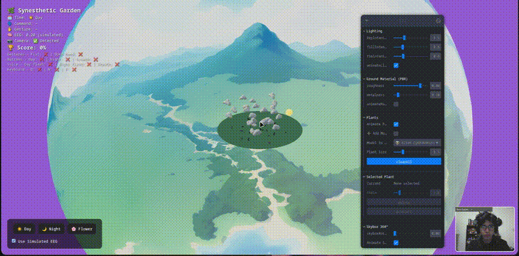
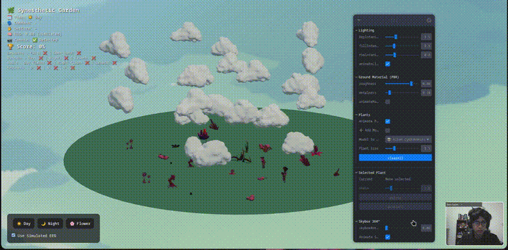
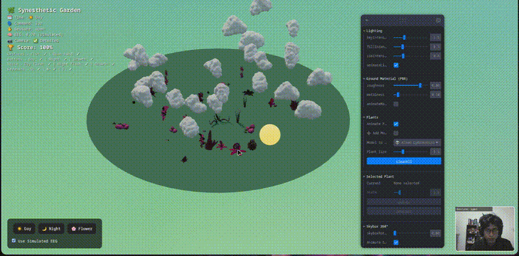
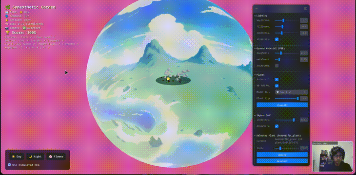

## Synesthetic Garden: Jardín Sinestésico Interactivo

## Integrantes 

- Deibyd Santiago Barragán Gaitán.
- Paul Marie Emptoz.
- Juan Felipe Hernandez Ochoa.
- Juan Diego Mendoza Torres.
- Julián David Osorio Amaya.

### Descripción general del taller 
Synesthetic Garden es una aplicación web interactiva desarrollada para el Taller 3 de visión por computadora. Integra detección de gestos mediante cámara web, reconocimiento de voz, simulación de EEG y controles de entrada multimodal (teclado, mouse, touch) para manipular una escena 3D de un jardín virtual. Los usuarios pueden cambiar entre modo día/noche, activar efectos visuales en plantas y luces, y completar un minijuego que requiere explorar todos los métodos de interacción para alcanzar el 100% de puntaje. El proyecto cumple con los puntos 6 (entrada e interacción: UI, input y colisiones) y 7 (gestos con cámara web: detección de manos, conteo de dedos, mapeo a acciones visuales, minijuego gestual sin hardware adicional).

El enfoque principal es la sinestesia: gestos y voz afectan visuales (e.g., "flor" hace crecer plantas), mientras la EEG simulada altera colores. Se corrigieron errores en la detección de cámara y gestos, migrando a la API moderna de MediaPipe para mayor precisión.

### Tecnologías utilizadas
- **Frontend y 3D**: React, @react-three/fiber y Three.js para renderizado de escena, modelos GLB de plantas y efectos de iluminación/emisivos.
- **Detección de gestos**: @mediapipe/tasks-vision (HandLandmarker) para procesamiento en tiempo real de video, conteo de dedos y mapeo a comandos ('open' → día, 'fist' → noche).
- **Reconocimiento de voz**: Web Speech API para comandos en español ("luz", "flor", "noche").
- **Simulación EEG**: Valores aleatorios que interpolan colores (lerp entre frío/cálido) en fondo.
- **Interacción**: Eventos de teclado/mouse/touch, UI HTML con botones y slider, colisiones en modelos 3D via onClick.
- **Minijuego**: Estado de puntaje con useMemo, tracking de acciones únicas (gestos, botones, teclas) para victoria al 100%.
- **Herramientas de desarrollo**: Vite para build, Leva (opcional para controles iniciales, reemplazado por UI custom).

# DEPENDENCIAS

- npm install
- @react-three/fiber
- @react-three/drei
- leva
- react
- mediapipe

# ESTRUCTURA DEL REPOSITORIO

```
2025-10-26_taller_integrado_computacion_visual/
├── threejs/
├── gifs/
├── README.md
```


### Instalación
1. Clona el repositorio: `git clone [URL del repositorio]`.
2. Instala dependencias: `npm install`.
3. Descarga el modelo de MediaPipe: Ve a [https://storage.googleapis.com/mediapipe-models/hand_landmarker/hand_landmarker/float16/1/hand_landmarker.task] y colócalo en `/public/models/hand_landmarker.task`.
4. Ejecuta la app: `npm run dev`. Abre en http://localhost:5173.
5. Permite acceso a la cámara y micrófono en el navegador para gestos y voz.

**Requisitos**: Navegador moderno (Chrome recomendado para Web Speech y getUserMedia). HTTPS para despliegue en producción (e.g., Vercel/Netlify).

### Uso
- **Gestos con cámara**: La cámara se inicializa en la esquina inferior derecha. Abre la mano ('open') para modo "día" + comando 'luz' (flash luminoso). Cierra el puño ('fist') para "noche" + 'noche' (oscurecimiento temporal). Se dibujan landmarks y conexiones en el canvas overlay.
- **Comandos de voz**: Habla en español: "luz" para flash, "flor" para crecer plantas, "noche" para dim. El micrófono escucha continuamente.
- **EEG simulado**: Valores oscilan automáticamente (0-1), cambiando colores de escena (azul frío a rojo cálido). Usa el slider en UI para simular manualmente.
- **UI personalizada**: Botones para Día ('luz'), Noche ('noche'), Flor ('flor'). Slider para EEG.
- **Atajos de teclado**: 'd' para día, 'n' para noche, 'f' para flor.
- **Colisiones**: Haz clic en plantas 3D para activar 'flor' (escala temporal + animación).
- **Overlay de información**: Muestra tiempo, comando, gesto, EEG, cámara, puntaje y estado de acciones (✔/❌ para gestos, botones, teclas).

### Minijuego
El minijuego transforma la app en una experiencia gamificada: el objetivo es "activar" el jardín explorando todos los inputs. Para 100% de puntaje:
- Gestos: Puño y mano abierta (20% cada uno).
- Botones: Día, Noche, Flor (20% cada uno).
- Teclas: 'd', 'n', 'f' (20% cada uno, ajustado a 8 acciones totales para incrementos de 12.5%).
- Comandos por voz: Flash diurno, flash nocturno, flor.

Cada acción única suma puntos. El puntaje se calcula en tiempo real con useMemo. Al 100%, alerta "Congratulations!" con mención de acciones completadas. El overlay muestra progreso detallado con ✔/❌.

| Acción Requerida | Input | Efecto | Contribución al Puntaje |
|------------------|-------|--------|-------------------------|
| Puño | Gesto (fist) | Modo noche + 'noche' | 12.5% (primera vez) |
| Mano abierta | Gesto (open) | Modo día + 'luz' | 12.5% (primera vez) |
| Día | Botón o 'd' | Modo día | 12.5% (por botón/tecla) |
| Noche | Botón o 'n' | Modo noche | 12.5% (por botón/tecla) |
| Flor | Botón o 'f' | Crecimiento plantas | 12.5% (por botón/tecla) |
| Flash diurno | Botón o 'd' | Flash luminoso | Comando por voz |
| Flash nocturno | Botón o 'n' | Oscurecimiento | Comando por voz |

### Módulos aplicados 
Se aplicaron los siguientes módulos del taller:
- Materiales, luz y color (PBR y modelos cromáticos)
- Efectos personalizados
- Texturizado dinámico y partículas
- Visualización de imágenes y video 360° (Skybox)
- Entrada e interacción (UI, input y colisiones)
- Gestos con cámara web (Mediapipe Hands)
- Reconocimiento por voz y comandos 
- Interfaces multimodales (Voz + Comandos)
- Simulación BCI (EEG sintético y control)
- Espacios proyectivos y matrices de proyección 

### Código relevante 

#### Fragmento de App.jsx (integración multimodal)
```jsx
import { Canvas } from '@react-three/fiber'
import { useState, useCallback, useEffect, useMemo } from 'react'
import Scene from './components/Scene'
import useVoiceAndEEG from './hooks/useVoiceAndEEG'
import HandTracker from './components/HandTracker'
import CustomUI from './components/CustomUI'

function App() {
  const [timeOfDayState, setTimeOfDayState] = useState('day');
  const { command, setCommand, eegValue } = useVoiceAndEEG();
  const [gesture, setGesture] = useState(null);

  // Lógica de gestos
  const handleGesture = useCallback((g) => {
    setGesture(g);
    if (g === 'open') {
      setTimeOfDayState('day');
      setCommand('luz');
    } else if (g === 'fist') {
      setTimeOfDayState('night');
      setCommand('noche');
    }
  }, [setCommand]);

  // Teclado
  useEffect(() => {
    const handleKey = (e) => {
      if (e.key === 'd') { setTimeOfDayState('day'); setCommand('luz'); }
      if (e.key === 'n') { setTimeOfDayState('night'); setCommand('noche'); }
      if (e.key === 'f') { setCommand('flor'); }
    };
    window.addEventListener('keydown', handleKey);
    return () => window.removeEventListener('keydown', handleKey);
  }, []);

  return (
    <div style={{ width: '100vw', height: '100vh' }}>
      <HandTracker onGesture={handleGesture} />
      <Canvas camera={{ position: [0, 5, 15], fov: 60 }} shadows>
        <Scene timeOfDay={timeOfDayState} command={command} eegValue={eegValue} />
      </Canvas>
      <CustomUI setTimeOfDay={setTimeOfDayState} setCommand={setCommand} />
    </div>
  );
}
```

#### Fragmento de index.css (estilos base)
```css
:root {
  font-family: system-ui, Avenir, Helvetica, Arial, sans-serif;
  line-height: 1.5;
  color-scheme: light dark;
  background-color: #242424;
}
```
### Evidencias gráficas 
#### Movimiento con cámara 

#### Interacción para puntaje perfecto 

#### Interacción con menú

#### Interacción por voz 

<video controls="controls" src="./gifs/voice.mp4" style="max-width: 720px;">
  Your browser does not support the video tag.
</video>

#### Interacción con EEG simulado 


### Reflexión 
El taller impuso múltiples retos y aprendizajes para todos los integrantes, desde el trabajo en equipo hasta los requerimientos funcionales, pues la integración de múltiples funcionalidades y de manera modular requiere de coordinación y principios de análisis y diseño de software.

Haciendo enfasis en los requisitos funcionales del taller, se dificultó considerablemente la integración de texturas procedurales en la escena, problema que se intentará abordar de manera más específica en próximos talleres.

### Créditos y notas
- Basado en tutoriales de MediaPipe y React Three Fiber.
- Modelos 3D: Fuentes libres (GLB para plantas y skybox).
- Desarrollado para Taller 3: Cumple entrada/interacción (punto 6) y gestos/minijuego (punto 7).
- Limitaciones: Detección de gestos sensible a iluminación; voz solo en español (configurable).
- Contribuciones: Abre issues o PR en el repositorio para mejoras.
