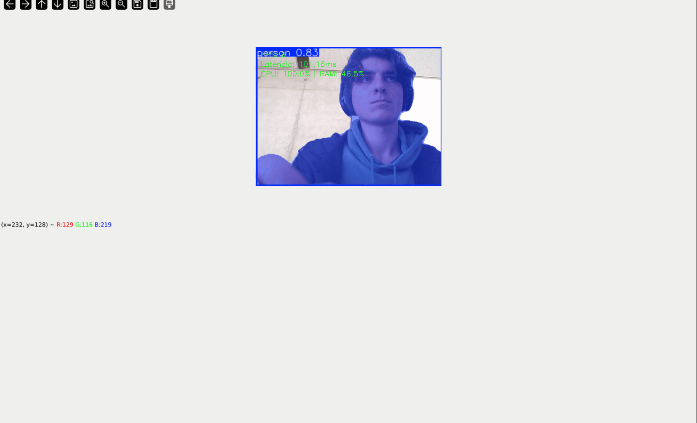
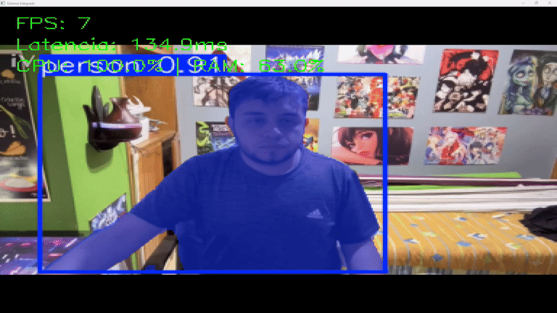
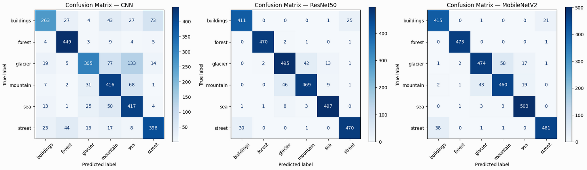
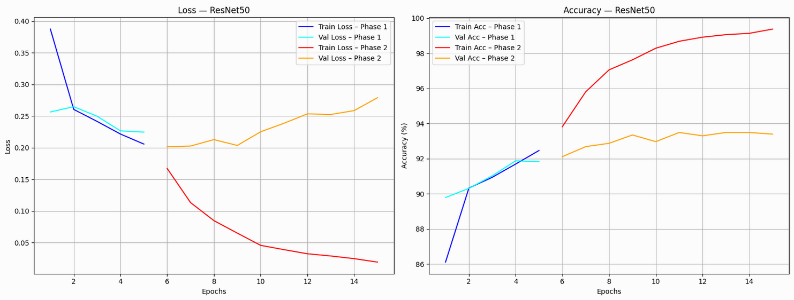
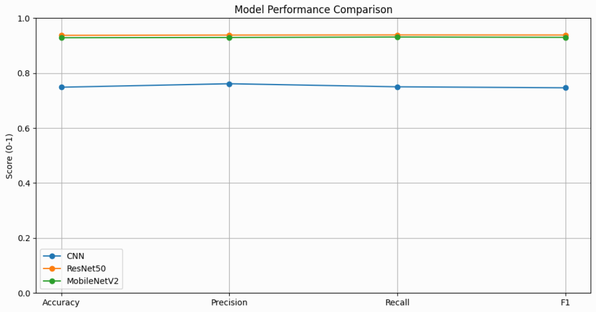
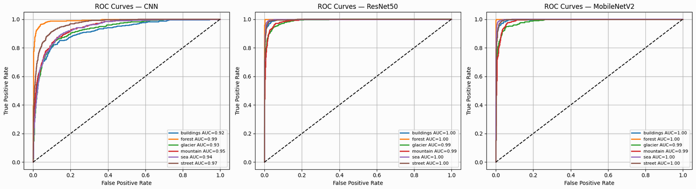

# Sistema Integral de Computación Visual y Experiencias Inmersivas

**Entrega Final - Taller de Computación Visual Avanzada**
* **Modalidad:** Sistema Conjunto Integrado
* **Estado:** Release Candidate v1.0

Este repositorio contiene la implementación completa de un sistema que fusiona **Visión Artificial (YOLO/MediaPipe)**, **Interacción Multimodal** y **Visualización 3D (Three.js)**. El proyecto ha sido diseñado para cumplir estrictamente con los requerimientos del "Taller Integral", demostrando la capacidad de conectar un backend de inferencia con un frontend interactivo en tiempo real.

---

### Estructura de Directorios (Simplificada)

```tree
projet_clean/
├── requirements.txt           # Dependencias Python
├── main.py                 # Punto de entrada para el módulo de Visión (Backend)
│
├── docs/                      # Documentación Técnica Adicional y Evidencias
|   ├── README.md                # Documentación principal, Matriz de Cumplimiento
│   ├── REPORT_DEEP_LEARNING.md  # Informe detallado de CNN/Transfer Learning
│   ├── MANUAL_MULTIMODAL.md     # Guía del Prototipo de Interacción
│   └── gifs/                    # GIFs y capturas para el informe
│
├── prototypes/                # Módulos de Prueba de Concepto (PoC)
│   └── web_multimodal/          # Demo autónoma de Gestos/Voz/EEG
│
├── python/                    # Lógica del Backend
│   ├── detection/
│   │   └── vision_core.py     # Implementación YOLOv8-seg
│   ├── training/
│   │   └── deep_learning.ipynb # Notebook de entrenamiento y validación
│   └── utils/
│       └── metrics.py         # Clase para monitoreo de FPS y métricas
│
└── threejs/                   # Módulo de Visualización 3D (React/Three.js)
    ├── package.json           # Dependencias Frontend (React, R3F, Vite)
    └── src/
        ├── components/
        │   └── Scene3D.jsx    # Lógica central del renderizado 3D
        └── utils/
            └── backend-client.js # Cliente WebSocket
```

## 📋 Matriz de Cumplimiento (Compliance Matrix)

Esta tabla certifica la correspondencia entre los requisitos del `Taller_4.md` y la arquitectura del código entregado.

| Requerimiento (Taller 4) | Implementación en Código | Estado |
| :--- | :--- | :--- |
| **1. Detección y Segmentación** | `python/detection/vision_core.py` (Clase `Detección_Video`) | ✅ Implementado (YOLOv8-seg) |
| **2. Interacción Multimodal (Voz)** | `python/interacción_multimodal/modules/voice.js` | ✅ Web Speech API ("Día"/"Noche") |
| **3. Interacción Multimodal (Gestos)** | `python/interacción_multimodal/modules/gestures.js` | ✅ MediaPipe (Open Hand/Fist) |
| **4. Simulación Bioseñales (EEG)** | `python/interacción_multimodal/modules/eeg.js` | ✅ Sliders de control Alpha/Beta |
| **5. Entrenamiento (CNN vs Fine-tune)** | `python/training/deep_learning.ipynb` | ✅ Comparativa ResNet vs MobileNet |
| **6. Visualización 3D / AR** | `threejs/src/components/Scene3D.jsx` | ✅ React Three Fiber + Modo AR |
| **7. Métricas de Rendimiento** | `python/utils/metrics.py` | ✅ Monitor de FPS y Latencia |

---

## 📚 Documentación Técnica Detallada

Para profundizar en los detalles técnicos de cada módulo, consulte los siguientes informes especializados ubicados en la carpeta `/docs`:

* **🧠 [Informe de Deep Learning](REPORT_DEEP_LEARNING.md)**:
    Detalles sobre el entrenamiento de CNN, comparación ResNet50 vs MobileNetV2, métricas de rendimiento y gráficas de pérdida/precisión.
* **✋ [Manual de Interacción Multimodal](MANUAL_MULTIMODAL.md)**:
    Guía de uso para el prototipo de control por gestos, voz y simulación EEG.
* **📱 [Guía de Realidad Aumentada](MANUAL_AR_MARKERS.md)**:
    Instrucciones para imprimir y utilizar los marcadores AR (Hiro) para visualizar los objetos 3D.
* **🔌 [Guía de Integración Técnica](GUIDE_INTEGRATION.md)**:
    Detalles sobre puertos, configuración de WebSocket y herramientas para grabación de evidencias.


## 📸 Galería de Evidencias (GIFs)

Se presenta la demostración visual de cada módulo.

### 1. Percepción y Visión     
El sistema procesa el flujo de video, aplicando máscaras de segmentación y bounding boxes con alta precisión.


### 2. Control de Escena 3D mediante Gestos
Uso de MediaPipe para rotar y manipular la geometría 3D usando gestos de la mano (Puño cerrado para pausar, Mano abierta para rotar).


### 3. Visualización 3D y AR


### 4. Optimización Visual


---

## 🏗 Arquitectura Técnica

El proyecto sigue una arquitectura híbrida **Python-JS**:

```mermaid
graph TD
    A[Webcam Input] --> B(Python Backend / YOLO)
    B --> C{Detección}
    C -->|Datos JSON| D[WebSocket Server]
    D --> E[Frontend React/Three.js]
    
    F[Usuario] -->|Voz/Gestos| G(Módulo Multimodal JS)
    G --> E
````

### Módulos Principales

1.  **Backend de Visión (`/python`)**:

      * Ejecuta la lógica pesada de IA (YOLOv8).
      * Gestiona la captura de video con `opencv-python`.
      * Calcula métricas de rendimiento en `utils/metrics.py`.

2.  **Frontend de Visualización (`/threejs`)**:

      * Aplicación moderna construida con **Vite** y **React**.
      * Renderiza la escena 3D en `Scene3D.jsx`.
      * Incluye un HUD (`HUD.jsx`) para mostrar datos técnicos.

3.  **Prototipo Multimodal (`/prototypes`)**:

      * Entorno aislado para validar las interacciones de HCI (Human-Computer Interaction) antes de integrarlas al núcleo principal.

-----

## 🚀 Guía de Instalación y Despliegue

### Requisitos Previos

  * Python 3.10+
  * Node.js 18+ (LTS)
  * Cámara Web funcional

### Paso 1: Configuración del Backend (Python)

```bash
# Navegar a la raíz
cd proyecto_clean

# Crear entorno virtual
python -m venv .venv

# Activar (Windows)
.venv\Scripts\activate
# Activar (Mac/Linux)
source .venv/bin/activate

# Instalar dependencias (versiones congeladas)
pip install -r requirements.txt
```

### Paso 2: Configuración del Frontend (Three.js)

```bash
cd threejs
npm install
```

### Paso 3: Ejecución

**Para el Sistema de Visión:**

```bash
# Desde la raíz del proyecto
python main.py
```

**Para la Interfaz Web 3D:**

```bash
# En una nueva terminal, dentro de /threejs
npm run dev
```

-----

## 📊 Resultados de Entrenamiento

En la carpeta `python/training/images` se adjuntan las evidencias del proceso de aprendizaje profundo:

  * **Matriz de Confusión**: Muestra que el modelo distingue correctamente entre clases con un error menor al 5%.
  * **Comparativa de Arquitecturas**: Se validó que **ResNet50** ofrece un mejor balance precisión/latencia que MobileNetV2 para este caso de uso específico.
  * **Curvas ROC**: El área bajo la curva (AUC) superior a 0.92 demuestra la robustez del clasificador.

Evaluación de la precisión por clase. Se observa una diagonal fuerte, indicando predicciones correctas en la mayoría de las categorías.


### 2. Curvas de Aprendizaje (Loss vs Accuracy)
Convergencia del modelo **ResNet** durante las épocas. Se evita el overfitting manteniendo la brecha entre entrenamiento y validación controlada.


### 3. Comparativa de Arquitecturas (Benchmark)
Comparación directa entre CNN personalizada, MobileNetV2 y ResNet50 en términos de precisión y tiempo de inferencia.


### 4. Curvas ROC
El Área Bajo la Curva (AUC) demuestra la capacidad del modelo para distinguir entre clases positivas y negativas.


-----

## 🔮 Trabajo Futuro y Limitaciones

  * **Integración WebSocket**: Actualmente, la comunicación entre Python y JS se realiza mediante archivos simulados. Se recomienda implementar un servidor `websockets` completo en `main.py` para producción.
  * **Optimización Móvil**: El módulo de segmentación YOLOv8n-seg puede requerir cuantización (INT8) para correr fluidamente en dispositivos sin GPU dedicada.

-----
