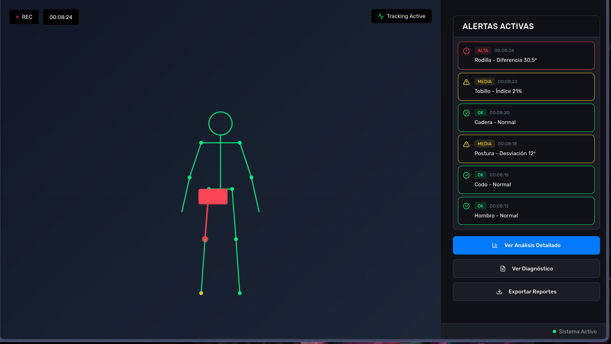
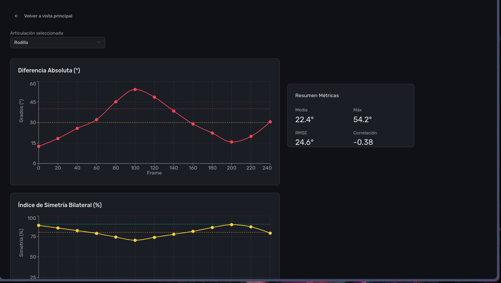
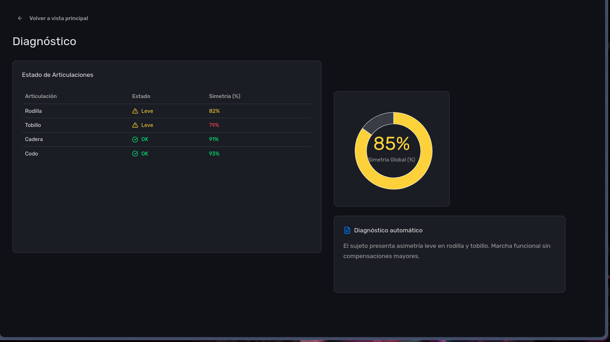
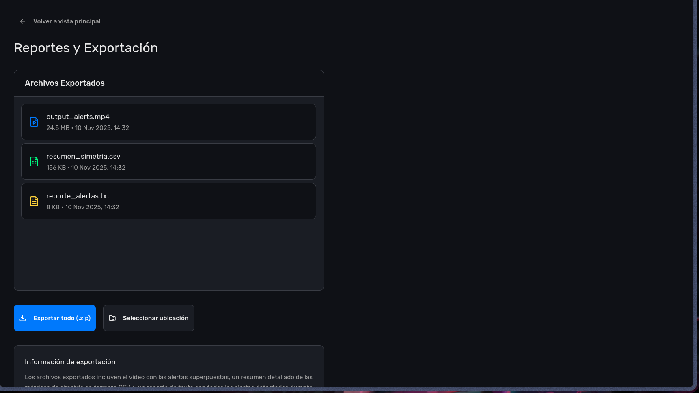
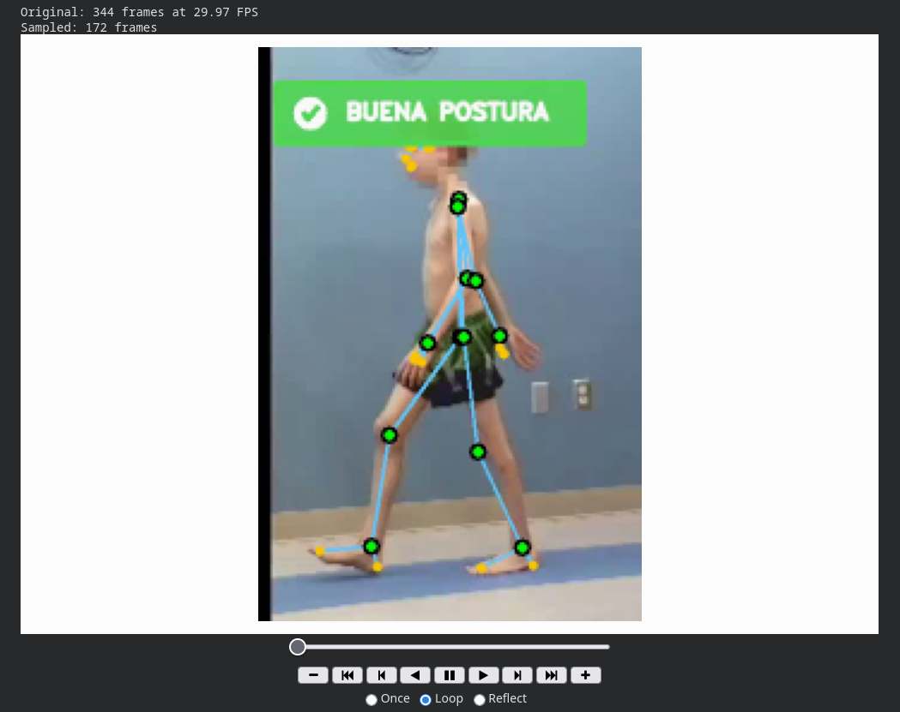
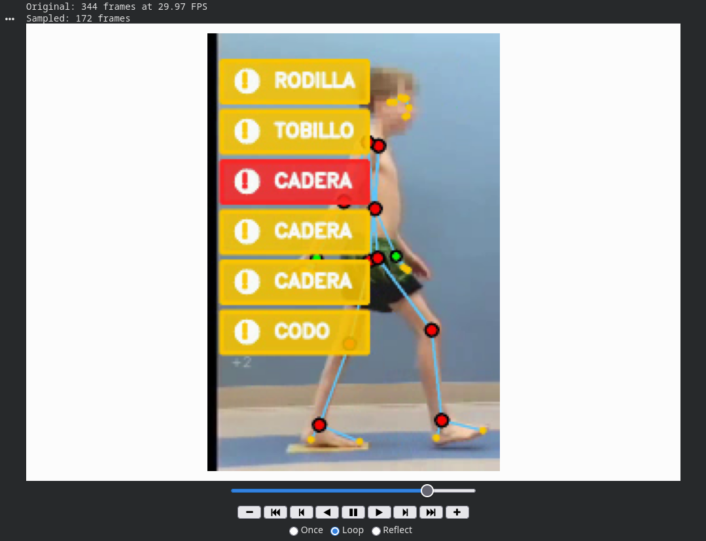
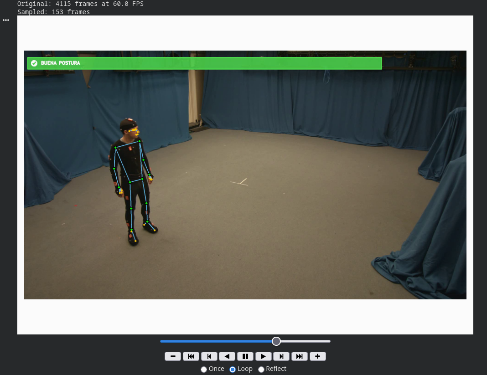
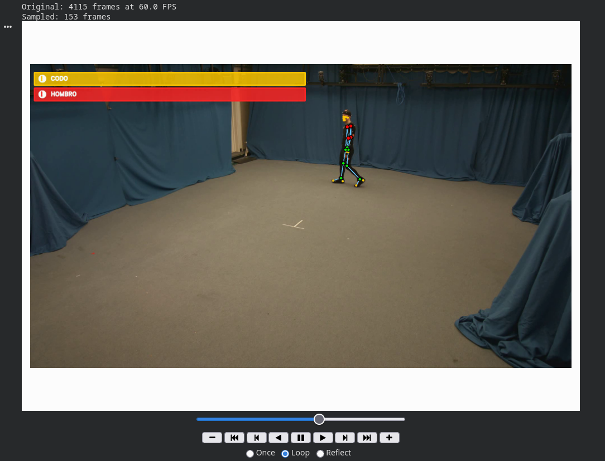

# Semana 8 - Movimiento Continuo y Mockups de la aplicación  

## 🎯 Objetivos

1. **Integrar análisis continuo de movimiento corporal** con generación de alertas continuas.
2. **Desarrollar mockups visuales** de la interfaz final del programa.  
2. **Hacer uso de dataset** para detección de postura continua.  

---

## 📊 Funcionalidades Implementadas

### 1. **Pipeline de Análisis de Movimiento Continuo**
Extiende el sistema de la semana 6, aplicando un análisis **frame a frame** sobre secuencias de video completas.

#### Características principales:

- Detección en tiempo real con **MediaPipe Pose**, generado en Semana 4 y 5.  
- Análisis de ventanas deslizantes (`window_size`) con actualización dinámica (`analyze_every`).  
- Integración directa con la clase `AsimetriaAnalyzer` generada en Semana 6 para mantener coherencia con métricas previas.  
- Renderizado en video de alertas y esqueleto coloreado según severidad.  
- Exportación automática de reportes, logs y métricas.

#### Estructura de salida:

| Archivo | Descripción |
|----------|-------------|
| `output_alerts.mp4` | Video anotado con alertas visuales en tiempo real |
| `alertas_por_frame.csv` | Registro detallado de cada alerta detectada |
| `log_alertas.txt` | Bitácora textual con mensajes y tipos de alerta |
| `resumen_simetria.csv` | Tabla resumen con métricas por articulación |

---

### 2. **Sistema de Visualización Avanzado**

Se mejoró el formato visual de las alertas en video:

- Fondo translúcido para mayor legibilidad.  
- Tipografía clara con color codificado:
  - 🔴 **ALTA severidad** (rojo)
  - 🟡 **MEDIA severidad** (amarillo)
- Máximo de 3 alertas visibles por frame.  
- Íconos y jerarquía visual (nombre de articulación → tipo → mensaje).  

```python
# Ejemplo de renderizado de alertas (bloque central del pipeline)
overlay = frame.copy()
cv2.rectangle(overlay, (10, 10), (500, 120), (20, 20, 20), -1)
frame = cv2.addWeighted(overlay, 0.7, frame, 0.3, 0)

y = 40
for alert in frame_alerts[:3]:
    color = (0, 0, 255) if alert['severidad'] == 'ALTA' else (0, 255, 255)
    txt = f"{alert['articulacion'].upper()}: {alert['tipo']} ({alert['severidad']})"
    cv2.putText(frame, txt, (25, y), cv2.FONT_HERSHEY_SIMPLEX, 0.65, color, 2)
    y += 28
```

---

## 🧠 Estructura General del Proyecto

```
Semana_8/
├── images/
│   ├── base_video.png
│   ├── base_video_alert.png
│   ├── dataset_video.png
│   └── dataset_video_alert.png
│
├── mockups/
│   ├── mainView.png
│   ├── detailedAnalysis.png
│   ├── diagnostics.png
│   └── reports.png
│
├── Semana_8.ipynb
│
├── dt_input.mp4  
│
└── README.md
```

---

## 🧩 Mockups de la aplicación 

Los mockups se desarrollaron en **Figma (tema oscuro)** para representar la interfaz de usuario definitiva del sistema de análisis.

### 🎛️ Pantallas Diseñadas:

| Vista | Descripción |
|--------|--------------|
| 🖥️ **mainView.png** | Panel principal con video, métricas en vivo y alertas codificadas por color |
| 📈 **detailedAnalysis.png** | Gráficas temporales de simetría, diferencias angulares y correlaciones |
| 🧬 **diagnostics.png** | Diagnóstico automático con severidad por articulación |
| 📑 **reports.png** | Reporte consolidado de métricas y alertas exportables en PDF |

#### Ejemplo de Mockups:

| Main View | Detailed Analysis |
|------------|------------------|
|  |  |

| Diagnostics | Reports |
|--------------|----------|
|  |  |

---

## Uso del Notebook

### Instalación de dependencias

```bash
!pip install mediapipe opencv-python numpy pandas matplotlib seaborn scipy
```

### Ejecución

```python
results = run_pipeline(
    input_path=input_video_path,
    tpose_path=tpose_image_path,
    output_path=output_video_path,
    window_size=WINDOW_SIZE,
    analyze_every=ANALYZE_EVERY,
    show_preview=SHOW_PREVIEW
)

print("\n== Primeras alertas detectadas ==")
display(pd.read_csv(results['alerts_csv']).head())

print("\n== Resumen de simetría (tabla) ==")
display(pd.read_csv(results['resumen_csv']).head())
```

---

## Resultados Visuales

### Comparativa de Ejecución

| Video Base | Video con Alertas |
|-------------|------------------|
|  |  |

| Dataset Original | Dataset con Alertas |
|------------------|--------------------|
|  |  |

---

## Prompts Utilizados

> Para la generación de los mockups (Figma / IA Asistida) y visualización en Google Colab:

- "Given the following app description, code a Mockup template"
- "Figma: Given the following json desciption, code the mockups for ..."
- "How to visualize .mp4 files in Google Colab?"
- "Given the following guideline, generate a template for a README.md file"

---

## Conexión con Entregas Previas

| Semana | Tema | Integración |
|---------|------|-------------|
| **Semana 3** | Extracción de ángulos articulares | Datos base del movimiento |
| **Semana 4** | Consolidación de dataset de ángulos | Entradas para análisis |
| **Semana 6** | Análisis de simetría y detección de anomalías | Núcleo matemático |
| **Semana 8** | Movimiento continuo + mockups visuales | Interfaz y ejecución final ✅ |

---

## 📚 Referencias

Trumble, M., Gilbert, A., Malleson, C., Hilton, A., & Collomosse, J. (2017). Total Capture: 3D Human Pose Estimation Fusing Video and Inertial Sensors. In Proceedings of the British Machine Vision Conference (BMVC). Retrieved from https://cvssp.org/data/totalcapture/

---

## ✅ Resumen de Avances (Semana 8)

| Tarea | Estado |
|-------|:------:|
| 🔄 Integración del movimiento continuo | ✅ |
| 🚨 Enlace con alertas adaptativas | ✅ |
| 🎨 Mockups de la presentación final (Figma, Dark UI) | ✅ |
| 📈 Exportación de métricas y visualizaciones | ✅ |

---

📍 **Conclusión:**  
En esta semana se consolidó parte del pipeline del sistema, combinando análisis biomecánico en movimiento continuo con visualización estética y funcional, preparándose cada vez más para su presentación final.

---
