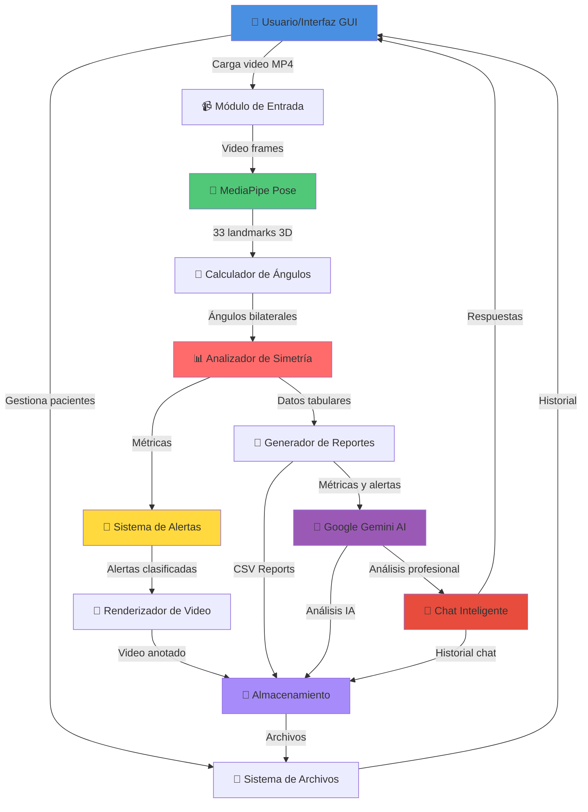

# 🚶 Sistema de Análisis Postural de Marcha

Sistema automatizado para evaluar la calidad postural durante la marcha mediante visión por computadora. Identifica y cuantifica desviaciones significativas respecto a patrones biomecánicos normales.

## 👥 Autores

- **Julian David Osorio Amaya**
- **Paul Marie Emptoz**
- **Juan Felipe Hernandez Ochoa**
- **Juan Diego Mendoza Torres**
- **Deibyd Santiago Barragán Gaitán**

---

## 📋 Descripción

Este proyecto utiliza MediaPipe Pose para detectar puntos clave del cuerpo humano y analizar la simetría bilateral durante la marcha. El sistema procesa videos, calcula ángulos articulares, detecta asimetrías y genera reportes automáticos con alertas de severidad.

---

## 🎬 Demostración del Sistema

### Video de Análisis en Tiempo Real

El siguiente video muestra el sistema procesando una marcha y detectando asimetrías en tiempo real:


*Video procesado mostrando: detección de landmarks, esqueleto coloreado según severidad y alertas superpuestas*

### Capturas de Pantalla


*Interfaz principal con gestión de pacientes y carga de video*


*Barra de progreso durante el análisis frame por frame*


*Reportes CSV descargables con métricas de simetría*

> **Nota**: Los GIFs y capturas de pantalla se encuentran en la carpeta `Proyecto/Semana_13/semana_13/`

---

## 🎯 Entrega Final - Sistema Profesional con Inteligencia Artificial

La versión final del proyecto es un sistema de análisis biomecánico que integra visión por computadora (MediaPipe) con inteligencia artificial (Google Gemini 2.5) para proporcionar evaluaciones fisioterapéuticas completas y automatizadas.

### ⭐ Características Principales

**Gestión de Pacientes**
- Crear nuevos pacientes con ID único y nombre
- Cargar pacientes existentes desde el historial
- Guardar automáticamente todas las sesiones de análisis por paciente
- Estructura organizada: `patients_data/{patient_id}/sessions/{timestamp}/`
- Comparación entre múltiples sesiones para seguimiento de progreso

**Análisis de Video**
- Carga de videos en formato MP4 con validación automática
- Procesamiento frame por frame con MediaPipe Pose
- Extracción automática de ángulos articulares bilaterales
- Análisis de ventanas deslizantes (30 frames, análisis cada 10)
- Barra de progreso en tiempo real durante el análisis
- Generación de video en cámara lenta (0.14x) para revisión detallada

**Análisis con Inteligencia Artificial**
- Integración con Google Gemini 2.5 para interpretación profesional
- Evaluación automática con 8 secciones especializadas:
  - Evaluación general del paciente
  - Hallazgos principales detectados
  - Análisis biomecánico detallado
  - Posibles causas de las asimetrías
  - Recomendaciones terapéuticas personalizadas
  - Precauciones y contraindicaciones
  - Plan de seguimiento sugerido
  - Clasificación de riesgo (bajo/medio/alto)
- Chat conversacional inteligente para consultas específicas
- Contexto persistente del análisis durante la conversación
- Historial de chat guardado por sesión

**Detección de Asimetrías**
- Cálculo de 4 métricas de simetría por articulación:
  - Diferencia absoluta entre lados (grados)
  - Índice de simetría (porcentaje)
  - RMSE (Root Mean Square Error)
  - Coeficiente de correlación de Pearson
- Sistema de alertas con tres niveles de severidad:
  - ALTA (rojo): Desviaciones críticas que requieren atención inmediata
  - MEDIA (amarillo): Desviaciones moderadas para monitoreo
  - BAJA (verde): Desviaciones menores dentro de rangos aceptables
- Umbrales adaptativos según tipo de articulación

**Visualización**
- Video anotado (`output_alerts.mp4`) con:
  - Esqueleto dibujado sobre el cuerpo
  - Alertas superpuestas con color según severidad
  - Máximo 3 alertas visibles por frame
  - Fondo translúcido para mejor legibilidad
- Reproducción automática al finalizar el análisis

**Reportes y Exportación**
- `resumen_simetria.csv`: Tabla con métricas globales por articulación
  - Diferencia media y máxima (grados)
  - Índice de simetría promedio (%)
  - RMSE y correlación
  - Total de alertas detectadas
  - Estado de cada articulación (Normal/Crítico)
- `alertas_por_frame.csv`: Detalle de cada alerta con:
  - Frame exacto de ocurrencia
  - Articulación afectada
  - Tipo de métrica que generó la alerta
  - Severidad y valor medido
- `output_alerts.mp4`: Video en cámara lenta con anotaciones visuales
- `chat_history.json`: Historial completo de conversación con IA
- Descarga directa desde la interfaz con un click

**Historial y Comparaciones**
- Ver sesiones anteriores del mismo paciente
- Comparar evolución de métricas entre sesiones
- Acceso rápido a reportes y videos previos

### 🏗️ Arquitectura del Sistema

El sistema sigue una arquitectura modular de procesamiento en pipeline:



### Componentes Principales

1. **Interfaz Gráfica (CustomTkinter)**: GUI moderna con 3 paneles y 5 pestañas de resultados
2. **MediaPipe Pose**: Extracción de 33 landmarks corporales en 3D
3. **Calculador de Ángulos**: Determina ángulos de 6 articulaciones bilaterales
4. **Analizador de Simetría**: Compara lados usando 4 métricas matemáticas
5. **Sistema de Alertas**: Clasifica desviaciones en 3 niveles de severidad
6. **Google Gemini AI**: Interpretación profesional y análisis fisioterapéutico
7. **Chat Inteligente**: Interfaz conversacional con contexto persistente
8. **Generador de Reportes**: Crea archivos CSV con métricas detalladas
9. **Renderizador**: Anota video con esqueleto y alertas visuales en cámara lenta

### 📁 Estructura de Archivos

```
EntregaFinal/
├── main.py                     # Punto de entrada
├── main_app.py                 # Aplicación principal
├── config.py                   # Configuración centralizada
├── requirements.txt            # Dependencias del proyecto
├── .env.example                # Template para variables de entorno
│
├── Core Analysis/
│   ├── pipeline_semana8.py     # Pipeline de análisis de video
│   ├── analysis_worker.py      # Gestión de análisis en threads
│   └── video_processor.py      # Procesamiento de videos
│
├── AI Integration/
│   ├── gemini_analyzer.py      # Integración con Google Gemini
│   └── api_key_manager.py      # Gestión segura de API keys
│
├── Data Management/
│   └── patient_manager.py      # Gestión de pacientes y sesiones
│
├── User Interface/
│   ├── ui_components.py        # Componentes reutilizables
│   ├── chat_widget.py          # Interfaz de chat con IA
│   └── dialogs.py              # Ventanas de diálogo
│
└── patients_data/              # Datos de pacientes (auto-generado)
    └── {patient_id}/
        ├── metadata.json       # Info del paciente
        └── sessions/
            └── {timestamp}/
                ├── session_metadata.json
                ├── resumen_simetria.csv
                ├── alertas_por_frame.csv
                ├── output_alerts.mp4
                └── chat_history.json
```

### 🔧 Instalación

**Requisitos**
- Python 3.12 o superior
- Sistema operativo: Windows/Linux/MacOS
- API Key de Google Gemini ([obtener aquí](https://makersuite.google.com/app/apikey))

**Pasos de Instalación**

1. **Crear entorno virtual**
```bash
python -m venv venv
source venv/bin/activate  # Linux/Mac
# o
venv\Scripts\activate  # Windows
```

2. **Instalar dependencias**
```bash
cd Proyecto/EntregaFinal
pip install -r requirements.txt
```

3. **Configurar API Key**

Crear archivo `.env` en `Proyecto/EntregaFinal/`:
```env
GEMINI_API_KEY=tu_api_key_aqui
```

4. **Verificar instalación**
```bash
python test_gemini_models.py
```

### 💻 Uso

1. **Iniciar la aplicación**
```bash
cd Proyecto/EntregaFinal
python main.py
```

2. **Seleccionar o crear paciente**
   - Click en "Seleccionar/Crear Paciente"
   - Elegir paciente existente o crear uno nuevo con ID y nombre

3. **Cargar video**
   - Click en "Cargar Video"
   - Seleccionar archivo MP4 de la marcha del paciente
   - El sistema validará formato y codec automáticamente

4. **Analizar**
   - Click en "Iniciar Análisis"
   - Esperar a que termine el procesamiento (5-10 minutos)
   - El sistema genera automáticamente:
     - Video anotado en cámara lenta
     - Reportes CSV con métricas
     - Análisis profesional con IA

5. **Revisar resultados**
   - **Pestaña Resumen**: Ver métricas globales por articulación
   - **Pestaña Alertas**: Explorar alertas frame por frame
   - **Pestaña Comparaciones**: Comparar con sesiones anteriores
   - **Pestaña Análisis IA**: Leer evaluación profesional completa
   - **Pestaña Chat**: Hacer preguntas específicas sobre el análisis

6. **Interactuar con IA**
   - Usar el chat para consultas como:
     - "¿Qué ejercicios recomiendas para la cadera?"
     - "¿Es grave la asimetría en la rodilla?"
     - "Explica el análisis biomecánico"
   - El contexto del análisis se mantiene durante la conversación

### Articulaciones Analizadas

El sistema analiza 6 pares de articulaciones bilaterales:
- Rodilla (derecha/izquierda)
- Tobillo (derecha/izquierda)
- Cadera (derecha/izquierda)
- Codo (derecha/izquierda)
- Muñeca (derecha/izquierda)
- Hombro (derecha/izquierda)

---

## 📈 Avances

### Semana 1
- Investigación inicial sobre análisis de marcha
- Definición de objetivos del proyecto
- Selección de tecnologías: MediaPipe, OpenCV, Python

### Semana 3
- Implementación de detección de landmarks con MediaPipe Pose
- Extracción de puntos clave del cuerpo desde imágenes y videos
- Cálculo de ángulos articulares básicos
- Referencia de posición T-pose para calibración inicial
- Visualización de esqueleto sobre frames de video

### Semana 4-5
- Desarrollo de clase `AngleTracker` para seguimiento temporal
- Extracción de ángulos para las 6 articulaciones principales bilaterales
- Almacenamiento de datos en estructuras DataFrame de pandas
- Generación de gráficas de evolución temporal de ángulos
- Procesamiento completo de videos con landmarks

### Semana 6
- Creación de clase `AsimetriaAnalyzer` para análisis de simetría
- Implementación de 4 métricas matemáticas:
  - Diferencia absoluta bilateral
  - Índice de simetría normalizado
  - RMSE entre lados
  - Correlación de Pearson
- Sistema de alertas con umbrales adaptativos por articulación
- Clasificación de severidad (ALTA/MEDIA/BAJA)
- Generación de reportes CSV con métricas de simetría

### Semana 7
- Refinamiento de umbrales de detección
- Ajustes en la precisión del análisis
- Optimización de procesamiento

### Semana 8
- Integración de análisis continuo sobre videos completos
- Pipeline completo frame por frame
- Análisis con ventanas deslizantes
- Renderizado de alertas sobre video:
  - Esqueleto coloreado según severidad
  - Alertas superpuestas con fondo translúcido
  - Máximo 3 alertas por frame
- Exportación de video anotado (`output_alerts.mp4`)
- Generación de logs de alertas (`log_alertas.txt`)
- Desarrollo de mockups de interfaz gráfica en Figma
- Diseño de 4 pantallas principales: Vista principal, Análisis detallado, Diagnósticos, Reportes

### Semana 9
- Prototipos de interfaz con Tkinter
- Diseño de flujo de usuario
- Pruebas de integración con el pipeline

### Semana 13
- Interfaz gráfica completa y funcional con Tkinter
- Gestión completa de pacientes con historial
- Integración total del pipeline de análisis
- Sistema de descarga de reportes
- Reproducción automática de videos anotados
- Comparación entre sesiones del mismo paciente
- Scripts de instalación y verificación

### Entrega Final (Actual)
- Migración a CustomTkinter para interfaz moderna
- Integración completa con Google Gemini 2.5 para análisis profesional
- Sistema de chat inteligente con contexto persistente
- Arquitectura modular con separación de componentes
- Procesamiento de video optimizado con cámara lenta
- Análisis fisioterapéutico automatizado en 8 secciones
- Gestión segura de API keys con variables de entorno
- Validación avanzada de videos (formato, codec, resolución)
- Comparación multi-sesión para seguimiento de progreso
- Documentación técnica completa y profesional

---

## 🛠️ Tecnologías Utilizadas

- **Python 3.12**: Lenguaje de programación principal
- **MediaPipe Pose**: Detección de 33 puntos clave del cuerpo en 3D
- **Google Gemini 2.5**: Inteligencia artificial para análisis fisioterapéutico
- **OpenCV**: Procesamiento de video e imágenes
- **NumPy**: Cálculos matemáticos y operaciones con arrays
- **Pandas**: Manejo y análisis de datos tabulares
- **Matplotlib/Seaborn**: Visualización de gráficas y métricas
- **CustomTkinter**: Interfaz gráfica moderna y profesional
- **Pillow**: Procesamiento de imágenes para la GUI
- **Python-dotenv**: Gestión de variables de entorno

---

## 🚀 Futuras Mejoras

- Análisis comparativo con patrones de marcha normal
- Detección automática de ciclos de marcha
- Reportes en formato PDF con gráficas
- Dashboard web con históricos
- Exportación de datos para machine learning
- Integración con bases de datos clínicas

---

## 📚 Referencias Bibliográficas

### Fundamentos del Análisis de Simetría

1. **Herzog, W., Nigg, B. M., Read, L. J., & Olsson, E. (1989)**
   - "Asymmetries in ground reaction force patterns in normal human gait"
   - *Journal of Biomechanics*, 22(6-7), 531-536
   - DOI: 10.1016/0021-9290(89)90032-8
   - **Contribución**: Estableció que diferencias < 20° en rodilla son normales en marcha saludable

2. **Robinson, R. O., & Smidt, G. L. (1981)**
   - "Quantitative gait evaluation in the clinic"
   - *Physical Therapy*, 61(3), 351-353
   - **Contribución**: Definió que índice de simetría (SI) < 25% indica simetría aceptable

3. **Perry, J., & Burnfield, J. M. (2010)**
   - "Gait Analysis: Normal and Pathological Function" (2nd ed.)
   - Slack Incorporated
   - ISBN: 978-1556427664
   - **Contribución**: Estableció que correlación negativa en balanceo de brazos es esperada en marcha normal

4. **Winter, D. A. (2009)**
   - "Biomechanics and Motor Control of Human Movement" (4th ed.)
   - John Wiley & Sons
   - ISBN: 978-0470398180
   - **Contribución**: Documentó variabilidad en marcha normal (5-10% en parámetros temporales)

5. **Zifchock, R. A., Davis, I., Higginson, J., & Royer, T. (2008)**
   - "The symmetry angle: A novel, robust method of quantifying asymmetry"
   - *Gait & Posture*, 27(4), 622-627
   - DOI: 10.1016/j.gaitpost.2007.08.006
   - **Contribución**: Clasificación de asimetría:
     - SA < 10% = Simétrico
     - SA 10-20% = Moderadamente asimétrico
     - SA > 20% = Asimétrico

### Interpretación de Correlaciones en Marcha

6. **Wagenaar, R. C., & Beek, W. J. (1992)**
   - "Hemiplegic gait: a kinematic analysis using walking speed as a basis"
   - *Journal of Biomechanics*, 25(9), 1007-1015
   - **Contribución**: Demostró que movimientos alternados presentan correlaciones negativas

7. **Plotnik, M., Giladi, N., & Hausdorff, J. M. (2007)**
   - "A new measure for quantifying the bilateral coordination of human gait: effects of aging and Parkinson's disease"
   - *Experimental Brain Research*, 181(4), 561-570
   - **Contribución**: Índices de coordinación bilateral en marcha normal vs patológica

### Índice de Simetría y Métricas

8. **Robinson, R. O., Herzog, W., & Nigg, B. M. (1987)**
   - "Use of force platform variables to quantify the effects of chiropractic manipulation on gait symmetry"
   - *Journal of Manipulative and Physiological Therapeutics*, 10(4), 172-176
   - **Contribución**: Primera aplicación sistemática del índice de simetría en análisis de marcha

### Tecnología y Visión por Computadora

9. **Trumble, M., Gilbert, A., Malleson, C., Hilton, A., & Collomosse, J. (2017)**
   - "Total Capture: 3D Human Pose Estimation Fusing Video and Inertial Sensors"
   - *Proceedings of the British Machine Vision Conference (BMVC)*
   - Disponible en: https://cvssp.org/data/totalcapture/
   - **Contribución**: Captura de movimiento humano 3D usando visión por computadora

---

## 🔬 Fundamento Teórico

### Análisis de Simetría Bilateral

La simetría bilateral es un indicador clave de la calidad de la marcha. En condiciones normales, se espera que ambos lados del cuerpo se muevan de manera coordinada y con diferencias mínimas. Las asimetrías pueden indicar:

- Lesiones musculoesqueléticas
- Desequilibrios posturales
- Patrones compensatorios
- Condiciones neurológicas

### Métricas Implementadas

**1. Diferencia Absoluta**
```
Diff = |Ángulo_Derecho - Ángulo_Izquierdo|
```
Medida directa y fácil de interpretar. Valores > 20° se consideran significativos según Herzog et al. (1989).

**2. Índice de Simetría (SI)**
```
SI = (Derecho - Izquierdo) / ((Derecho + Izquierdo) / 2) × 100
```
Normaliza respecto al promedio. SI < 25% indica simetría aceptable (Robinson & Smidt, 1981).

**3. RMSE (Root Mean Square Error)**
```
RMSE = √(Σ(Derecho - Izquierdo)² / n)
```
Penaliza diferencias grandes. Útil para detectar picos de asimetría.

**4. Coeficiente de Correlación de Pearson**
```
r = Σ((x - x̄)(y - ȳ)) / √(Σ(x - x̄)² × Σ(y - ȳ)²)
```
Mide sincronización temporal. Valores cercanos a 1 indican alta coordinación. En movimientos alternados (brazos), se esperan correlaciones negativas (Wagenaar & Beek, 1992).

### Umbrales Adaptativos

Los umbrales varían según la articulación:

| Articulación | Umbral Diferencia | Umbral SI | Motivo |
|--------------|-------------------|-----------|--------|
| Rodilla/Cadera | 20° | 15% | Mayor rango de movimiento |
| Tobillo | 15° | 20% | Movimiento más sutil |
| Hombro/Codo/Muñeca | 25° | 20% | Mayor variabilidad natural |

