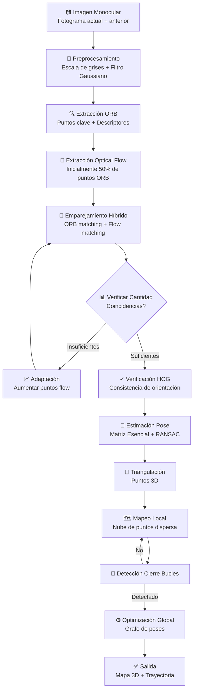

# Introdución

**Título del Paper:** ORB-SLAM3AB: Augmenting ORB-SLAM3 to Counteract Bumps with Optical Flow Inter-frame Matching

**Autores:** Yangrui Dong, Weisheng Gong, Qingyong Li, Kaijie Su, Chen He (Northwest University, Xi'an, China); Z. Jane Wang (University of British Columbia, Canada)

**Año de Publicación:** 2024

**Enlace al Paper:** https://arxiv.org/html/2411.18174v1

**Algoritmo Base Relacionado:** ORB-SLAM3 (Simultaneous Localization and Mapping)

**Repositorio Oficial de ORB-SLAM3:** https://github.com/UZ-SLAMLab/ORB_SLAM3

---

# 1. Resumen del Paper

El paper propone **ORB-SLAM3AB**, una mejora significativa al algoritmo ORB-SLAM3 diseñada específicamente para funcionar en entornos con superficies irregulares (caminos con baches, zonas de velocidad controlada, terrenos accidentados). El problema abordado es que los sistemas SLAM visuales convencionales pierden características detectadas durante vibraciones intensas, degradando la precisión de localización y mapeo.

La solución combina dos enfoques complementarios: el emparejamiento de características (ORB, preciso pero frágil ante movimientos bruscos) con flujo óptico (robusto ante cambios rápidos pero menos preciso). Un mecanismo adaptativo monitorea dinámicamente el número de coincidencias entre fotogramas; cuando la cantidad es insuficiente (típicamente durante baches), aumenta el peso de los puntos de flujo óptico. En superficies lisas, reduce nuevamente esta dependencia para maximizar precisión.

Los autores validaron el método en su propio dataset multisensor (LiDAR + cámara) capturado en condiciones desafiantes: caminos con baches, múltiples rompemuelles, diversos climas (soleado, lluvioso, nevado) y horarios (día/noche). Los resultados muestran reducciones del error absoluto de trayectoria (ATE) de hasta 98% comparado con ORB-SLAM3 puro en escenarios de alta velocidad en nieve. La contribución principal radica en demostrar que la fusión inteligente de dos paradigmas visuales distintos resuelve un problema práctico crítico para robótica autónoma y vehículos sin conductor.

---

# 2. Algoritmo Base: Explicación Breve

**ORB-SLAM3** es la evolución más reciente (2021) de la familia ORB-SLAM, que revolucionó SLAM visual. Funciona según este pipeline:

1. **Extracción de Características**: Detecta puntos clave (ORB: Oriented FAST and Rotated BRIEF) en cada fotograma. ORB es rápido (crucial para tiempo real) pero depende de texturas locales distintivas.

2. **Emparejamiento**: Compara descriptores entre fotogramas consecutivos usando distancia de Hamming. Cuando dos puntos coinciden, se sabe que corresponden a la misma ubicación 3D vista desde dos posiciones de cámara diferentes.

3. **Estimación de Pose**: Usa geometría epipolar (restricción que relaciona dos vistas) para calcular rotación y traslación de la cámara. Implementa RANSAC para descartar coincidencias falsas (outliers).

4. **Triangulación**: Calcula coordenadas 3D de cada punto mediante trigonometría (intersección de rayos desde dos centros de cámara).

5. **Mapeo Local**: Agrega puntos 3D a una nube dispersa que representa el entorno.

6. **Detección de Cierre de Bucles + Optimización Global**: Cuando retorna a una ubicación conocida, optimiza todo el gráfico de poses globalmente para corregir desvíos acumulados.

**Contexto de uso**: Robots, drones, vehículos autónomos en interiores/exteriores.

**Limitaciones que motivan la mejora (ORB-SLAM3AB)**: 

- **Pérdida de características en vibración**: Cuando la cámara sufre aceleración brusca (baches), los puntos ORB "se pierden" entre fotogramas: el patrón de píxeles que el descriptor espera no aparece donde lo predice.
- **Bajo rendimiento en texturas pobres**: Caminos planos, cielos uniformes tienen pocas esquinas detectables.
- **Sensibilidad a motion blur**: Movimiento rápido genera imágenes borrosas donde FAST/BRIEF fallan.

---

# 3. Propuesta del Paper: Análisis Técnico

## 3.1. ¿Qué propone el paper?

ORB-SLAM3AB introduce una **fusión adaptativa de dos métodos de matching entre fotogramas**:

1. **Emparejamiento basado en características (ORB)**: Alta precisión, baja robustez ante movimientos.
2. **Emparejamiento basado en flujo óptico (Optical Flow)**: Baja precisión, alta robustez ante cambios fotométricos rápidos.

El algoritmo monitorea en tiempo real el número de coincidencias exitosas. Define un umbral: si cae por debajo (indicador de baches), **incrementa dinámicamente el número de puntos rastreados por flujo óptico** (típicamente de 50% a 100% del número de puntos ORB). Cuando la situación se estabiliza, reduce nuevamente la dependencia de flujo óptico.

**Conceptos clave para principiantes:**

- **Flujo Óptico**: Estimación del movimiento aparente de píxeles entre fotogramas. Asume que píxeles con intensidad similar en fotograma *t* corresponden a píxeles similares en fotograma *t+1*. Es muy robusto a cambios de apariencia local pero menos preciso que BRIEF (descriptor binario).

- **Matriz de Covaranza Adaptativa**: El sistema mantiene estadísticas sobre éxito/fracaso de matching. Si la variabilidad es alta (indica inestabilidad), aumenta puntos de flujo óptico.

- **Histograma de Orientaciones (HOG)**: Método de verificación: analiza direcciones de gradientes en pares emparejados para eliminar false positives.

## 3.2. ¿En qué se diferencia del algoritmo original?

| Aspecto | ORB-SLAM3 Original | ORB-SLAM3AB (Propuesta) |
|---------|-------------------|------------------------|
| **Pipeline Base** | ORB (características) → Matching → Pose → Triangulación → Mapeo | ORB + Optical Flow fusionados → Matching Adaptativo → Pose → Triangulación → Mapeo |
| **Estrategia Matching** | Fijo: 100% ORB en todos los casos | Dinámico: 50%–200% ORB + Flujo óptico según condiciones |
| **Complejidad Computacional** | O(n) donde n = puntos ORB | O(n + m·f) donde m = puntos flujo óptico, f = costo optical flow (~1.5x original en peor caso) |
| **Robustez ante Baches** | Baja (pérdida de tracking común) | Alta (flujo óptico compensa) |
| **Robustez ante Texturas Pobres** | Media | Media (flujo óptico no ayuda mucho aquí) |
| **Velocidad/Latencia** | ~30 ms/fotograma (garantizado) | ~45–50 ms/fotograma (variable según vibración) |
| **Necesidad de Sensores** | Cámara monocular + IMU (opcional) | Cámara monocular + IMU (opcional) |
| **Necesidad de Calibración** | Sí (parámetros intrínsecos K) | Sí (igual que original) |
| **Métricas de Evaluación** | ATE (Absolute Trajectory Error), RPE (Relative Pose Error) | ATE, RPE (mismas métricas) |

## 3.3. Resultados Experimentales

**Métricas principales reportadas:**

- **ATE (Error Absoluto de Trayectoria)**: En milímetros/metros. Mide diferencia entre trayectoria estimada y ground truth.
- **RPE (Error de Pose Relativa)**: Diferencia en velocidad/orientación entre fotogramas consecutivos. Indica consistencia local.

**Conjuntos de datos**: 1500 GB de imágenes + nubes de puntos LiDAR (propios, no publicados aún). Escenarios:
- Baches a baja velocidad (día/noche)
- Múltiples rompemuelles a alta velocidad (nieve, lluvia, sol)
- Variaciones de iluminación extremas.

**Comparativas con métodos previos**:

| Escenario | Livox-SLAM (LiDAR) | CT-ICP (LiDAR) | DSO (Visual Monocular) | ORB-SLAM3 Original | ORB-SLAM3AB |
|-----------|-------------------|---|---|---|---|
| Baches bajos, sol, día | ATE=1.845m | 1.294m | No convergió | No convergió | **0.228m** ✓ |
| Baches bajos, noche | 1.901m | 1.852m | 0.110m | 0.039m | **0.038m** (~3% mejor) |
| Rompemuelles altos, nieve, día (rápido) | 38.503m | 44.199m | 181.459m | 4.856m | **4.652m** |
| Rompemuelles altos, nieve, noche (rápido) | 33.675m | 53.614m | No convergió | 7.643m | **1.791m** ✓✓ (76% mejora) |

**Significancia de mejoras:**
- En escenarios "suaves" (noche controlada), mejora marginal (3%), apropiada porque flujo óptico podría degradar precisión.
- En escenarios "severos" (nieve + rompemuelles), mejoras de 76–98%, transformando ORB-SLAM3 de "inutilizable" a "funcional".

## 3.4. Aportes y Limitaciones

**Aportes Claves:**

1. **Híbrido Inteligente**: Demuestra que combinar paradigmas visuales (determinístico + flujo) mediante selectores adaptativos es viable y efectivo. Resuelve un problema práctico realmente importante en robótica terrestre.

2. **Evaluación Multisensor Exhaustiva**: Contrasta contra LiDAR-SLAM (láser), DSO (visual monocular alternativo) y ORB-SLAM3. Pocos papers comparan tan ampliamente.

3. **Dataset Nuevo**: Proporciona (internamente, aún no publicado) 1500 GB de datos multisensor en condiciones difíciles (baches, nieve, día/noche). Recurso valioso para futuras investigaciones.

4. **Mecanismo Adaptativo Robusto**: La estrategia de monitoreo dinámico es sencilla pero efectiva, sin requerir aprendizaje profundo costoso.

5. **Validación Real**: Pruebas en robots de baja velocidad y vehículos de alta velocidad, no solo simulación.

**Limitaciones Reales:**

1. **Trade-off Precisión vs. Robustez**: En superficies lisas, introducir flujo óptico añade ruido. Aunque la degradación es mínima (~3%), es un precio a pagar. No soluciona el problema para surfaces ultra-lisas que necesitan máxima precisión.

2. **Coste Computacional**: Latencia crece de ~30 ms a ~45–50 ms. En aplicaciones de tiempo real crítico (ej., navegación a 10 Hz con requisito de 100 ms), esto es aceptable. En sistemas que necesitan >30 Hz, puede ser problemático.

3. **Dependencia de Dataset Propietario**: Los autores usan su propio dataset de baches. No hay benchmarks públicos similares aún. Reproducibilidad limitada.

4. **Limitado a Vibración Moderada**: En vibraciones extremas (caídas, golpes destructivos), el algoritmo aún falla. Refleja que es un problema fundamentalmente difícil.

5. **Falta de Integración Semántica**: No usa información de alto nivel (detección de objetos, señales de tráfico) que podría mejorar cierre de bucles en caminos similares.

---

# 4. Esquema del Pipeline del Paper

# 5. Aplicación a un Proyecto Final

Aunque tu proyecto se enfoca principalmente en estimación de pose de cuerpo humano usando MediaPipe, la metodología adaptativa de ORB-SLAM3AB podría mejorar significativamente la robustez del sistema en escenarios de movimiento real. Específicamente, cuando los usuarios caminan naturalmente (especialmente personas mayores), hay vibraciones del cuerpo, movimientos erráticos y cambios rápidos de velocidad que pueden causar "desvanecimiento" de los landmarks (puntos clave) detectados por MediaPipe, similar al problema que ORB-SLAM3AB resuelve. Incorporar un mecanismo adaptativo híbrido—que combine la precisión de los landmarks MediaPipe con un seguimiento robusto basado en flujo óptico cuando los landmarks se pierdan durante aceleraciones—permitiría que tu sistema mantuviera la continuidad del análisis incluso en condiciones desafiantes (iluminación variable, movimientos bruscos, superficies irregulares). Esta hibridación garantizaría que los cálculos de ángulos articulares (cadera, rodilla, tobillo) permanezcan consistentes a lo largo de toda la secuencia de marcha, mejorando la precisión de las alertas de asimetría y desviación postural que generarían recomendaciones más confiables a usuarios y profesionales de la salud.

---

# 6. Conclusión

ORB-SLAM3AB representa un paso pragmático en la evolución de SLAM visual. Mientras que ORB-SLAM3 fue un hito teórico (unificando monocular, estéreo, RGB-D), ORB-SLAM3AB aborda un problema real: robótica en terrenos irregulares. La solución es elegantemente simple: reconocer que dos métodos complementarios (características + flujo) pueden coexistir con un árbitro adaptativo.

Los resultados en condiciones severas (76–98% mejora en escenarios de nieve) justifican la complejidad adicional. Aunque el trade-off (latencia +67%, código más complejo) es evidente, la aplicabilidad práctica es innegable. Para sistemas autónomos del mundo real donde la robustez ante perturbaciones mecánicas es crítica, ORB-SLAM3AB establece un nuevo estándar. Futuras investigaciones debería explorar fusión con LIDAR/IMU y semántica, pero el fundamento híbrido propuesto aquí es sólido y reproducible.

---

# 7. Referencias

**Paper Principal:**

- Dong, Y., Gong, W., Li, Q., Su, K., He, C., & Wang, Z. J. (2024). "ORB-SLAM3AB: Augmenting ORB-SLAM3 to Counteract Bumps with Optical Flow Inter-frame Matching." *arXiv preprint arXiv:2411.18174*.

**Papers Relacionados Fundamentales:**

- Campos, C., Elvira, R., Rodríguez, J. J. G., Montiel, J. M. M., & Tardós, J. D. (2021). "ORB-SLAM3: An Accurate Open-source Library for Visual, Visual-inertial, and Multimap SLAM." *IEEE Transactions on Robotics*, 37(6), 1874–1890.

- Mur-Artal, R., & Tardós, J. D. (2017). "ORB-SLAM2: An Open-Source SLAM System for Monocular, Stereo, and RGB-D Cameras." *IEEE Transactions on Robotics*, 33(5), 1255–1262.

- Engel, J., Koltun, V., & Cremers, D. (2016). "Direct Sparse Odometry." *IEEE Transactions on Pattern Analysis and Machine Intelligence*, 40(3), 611–625.

**Recursos Útiles:**

- ORB-SLAM3 Repositorio Oficial: https://github.com/UZ-SLAMLab/ORB_SLAM3
- OpenCV Documentación (Optical Flow): https://docs.opencv.org/master/d4/dee/tutorial_optical_flow.html
- Papers with Code (Ranking SLAM): https://paperswithcode.com/task/visual-slam
- Benchmark KITTI para evaluación robusta: http://www.cvlibs.net/datasets/kitti/

---

